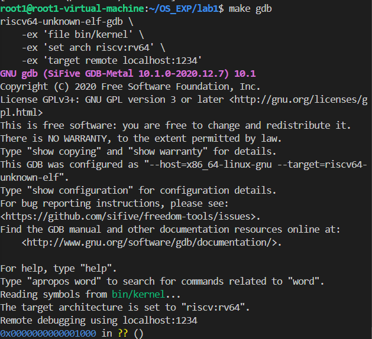
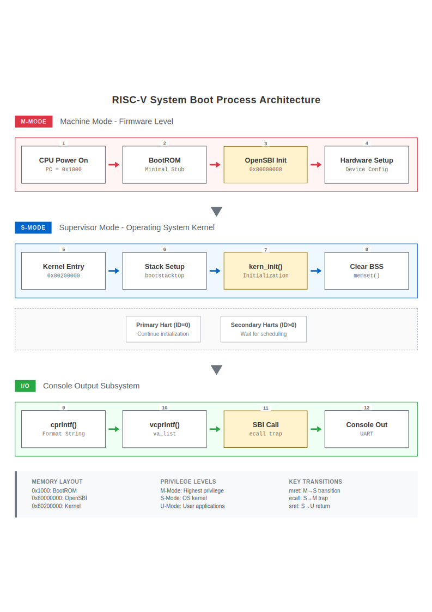
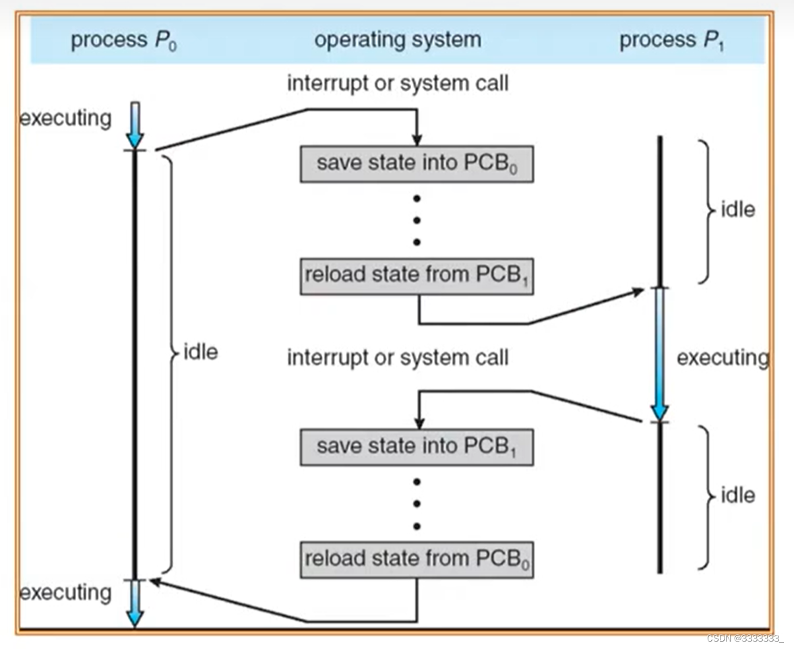
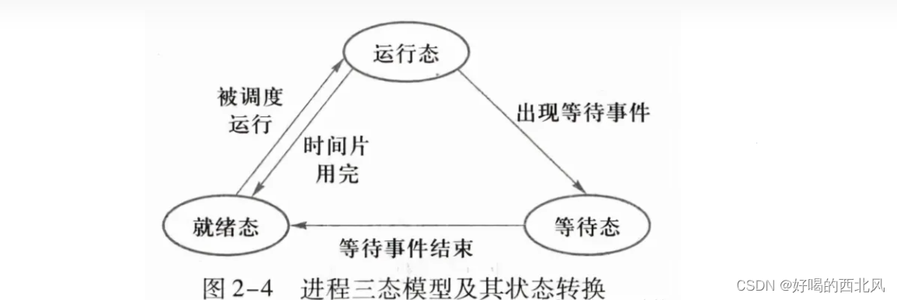
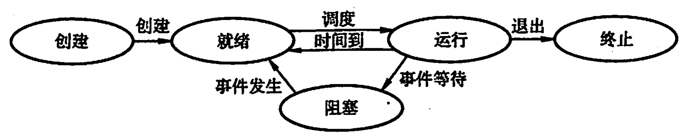
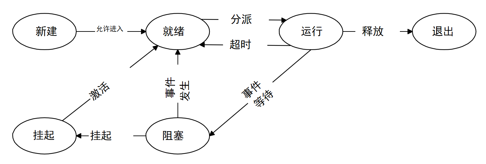
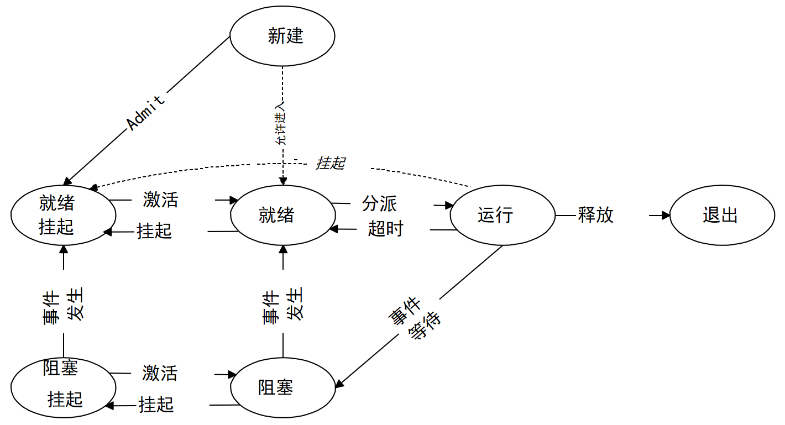
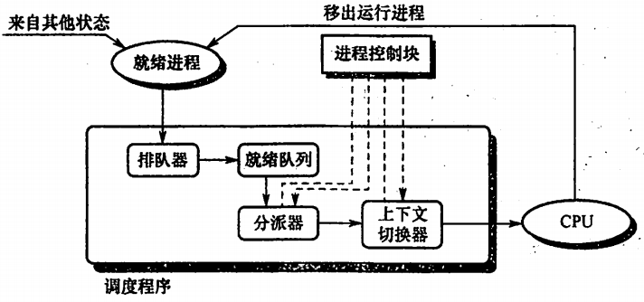

# 操作系统
# 练习解答
## 练习1：理解内核启动中的程序入口操作
### 题目描述
阅读 kern/init/entry.S内容代码，结合操作系统内核启动流程，说明指令 la sp, bootstacktop 完成了什么操作，目的是什么？ tail kern_init 完成了什么操作，目的是什么？
```c
#include <mmu.h>
#include <memlayout.h>

.section .text,"ax",%progbits
    .globl kern_entry
kern_entry:
    la sp, bootstacktop

    tail kern_init

.section .data
    # .align 2^12
    .align PGSHIFT
    .global bootstack
bootstack:
    .space KSTACKSIZE
    .global bootstacktop
bootstacktop:
```
### 问题解答
我们首先完整分析一下这个文件做了什么，这个文件需要结合其他文件一起阅读,才能明白其实际的意义。我们知道加载一个操作系统到内核上必须要首先通过bootloader加载OpenSBI，随后OpenSBI会加载内存镜像，那么此时在程序编写时必须要经过一个链接的过程，我们的内核入口在哪里、各段应该放到什么地址，告诉链接器并最终让 OpenSBI 跳转。通常通过链接脚本把入口符号设置为 ENTRY(kern_entry)，并按内核的虚拟内存布局（见 memlayout.h）把 .text/.data/.bss 等段放到期望的内核地址区间。OpenSBI 将内核镜像加载到物理内存后，在 S 模式把控制权转交给 kern_entry。于是我们查找kernel.ld文件，可以知道kern_entry是整个内核的入口。

接下来我们先逐行分析一下这份代码：
首先引入的两个库是让汇编文件走 C 预处理器（CPP），把两个头文件里的常量与宏（如 PGSHIFT、KSTACKSIZE、PGSIZE 等）引进来。这是因为后面要用到页大小相关的位数 PGSHIFT 和内核栈大小 KSTACKSIZE，这些通常定义在内存布局相关的头文件里，保持与 C 端一致。

接下来，由于下面是需要执行的代码，因此代码首先切换到 .text 段，并给这个段打上 ELF 标志："a"（alloc，可装载到内存），"x"（executable，可执行）。%progbits 表示该段是程序内容而非符号/重定位等。

随后，把符号 kern_entry 导出为全局可见，并定义了一个标签作为真正的入口。链接脚本通常会 ENTRY(kern_entry)，OpenSBI（或上一级引导）把控制权移交到这个符号。

接下来，我们跳过要分析的两句，分析数据段的代码。首先切到 .data 段，下面要放可写的全局数据（这里用于预留栈空间）。随后按 PGSHIFT 做$2^{PGSHIFT}$ 的对齐。GAS 在 RISC-V 上的 .align 等价于 .p2align，让后续的 bootstack 页对齐，保证栈跨页时不至于踩到奇怪的边界，也便于页表映射/保护。导出符号 bootstack，并在此打标签，表示“栈区的起始地址”。在当前段保留 KSTACKSIZE 字节的空间（内容默认清零/由加载器置零，视段而定）。导出 bootstacktop，并在 .space 之后打标签，等价于“bootstack + KSTACKSIZE”这个地址——即这块预留区的末尾，根据语义我们可以推知这个变量表示栈顶。

好了，有了上面的这些前置分析，我们就可以分析下面的两句代码了。
### 问题解答： la sp, bootstacktop
#### 做了什么：

la 是加载地址（load address）的伪指令，会被展开成取符号地址的指令序列（通常是 auipc + addi），把标签 bootstacktop 的绝对地址装入寄存器。sp 是 RISC-V ABI 规定的栈指针寄存器（x2）。把 bootstacktop 的地址放进 sp，等价于把内核的初始栈指针设置到 Boot 栈的顶部。我们从此处就可以知道我们对于这个变量的推断是正确的。

#### 目的：
在进入 C 代码之前建立一个可用且对齐良好的内核栈，确保后续 C 函数（包括 kern_init）的调用、保存返回地址、压栈/出栈等都能正常进行；如果不先设栈，任何函数调用或局部变量访问都会崩溃。

### 问题解答： tail kern_init
#### 做了什么：
tail 是 RISC-V 的尾调用伪指令，效果等价于无返回跳转到目标符号相当于 jal x0, kern_init 或“j kern_init”的可重定位形式，跳转到 kern_init，不写入返回地址寄存器 ra（x1），因此无法返回到 kern_entry。这与普通的 call（会写 ra）不同，tail 不会创建新的调用层级/返回路径。

#### 目的：

明确表明启动入口不会返回；kern_entry 完成最小初始化（建立栈）后，直接把控制权永久移交给 C 语言的内核主初始化函数 kern_init。由于没有返回，就不需要为 kern_entry 保留调用帧/保存 ra，更省栈、更简洁；避免以后误走回 kern_entry 的路径，符合“只前进不后退”的单向启动流程语义。

从启动流程角度：在设置好栈之后，通过尾跳转进入 kern_init，随后 kern_init 会完成更高层次的初始化（如控制台初始化、内存管理/页表建立、异常向量/中断启用、调度器/进程子系统等），最终进入内核的主循环/第一个进程。tail 确保这一步是最后一级的跳转。
## 练习2: 使用GDB验证启动流程

### 题目描述
为了熟悉使用 QEMU 和 GDB 的调试方法，请使用 GDB 跟踪 QEMU 模拟的 RISC-V 从加电开始，直到执行内核第一条指令（跳转到 0x80200000）的整个过程。通过调试，请思考并回答：RISC-V 硬件加电后最初执行的几条指令位于什么地址？它们主要完成了哪些功能？请在报告中简要记录你的调试过程、观察结果和问题的答案。

### 问题解答
使用GDB来调试操作系统内核不是一件容易的事，但是我们可以通过使用GDB调试QEMU来达到调试那个虚拟CPU的效果。因此此时我们需要启动两个东西：一个是GDB调试工具，另一个就是QEMU。启动这两个工具的代码可以见Makefile，这里我们简要分析一下两个指令。
qemu 目标有前置依赖：\$(UCOREIMG)（即 bin/ucore.img）,\$(SWAPIMG)、\$(SFSIMG)（这两个变量在当前文件里没定义→等价于空，不会触发任何动作），所以 make qemu = 先生成 bin/ucore.img ，然后启动 QEMU。

`UCOREIMG := $(call totarget,ucore.img)`，通常会展开到 `bin/ucore.img`。它的规则是：

```make
$(UCOREIMG): $(kernel)
	$(OBJCOPY) $(kernel) --strip-all -O binary $@
```

也就是：**先生成 `kernel` 可执行文件**，再用 `objcopy` 把它剥离成**纯二进制镜像** `ucore.img`。

`kernel` 的规则：

```make
$(kernel): tools/kernel.ld
$(kernel): $(KOBJS)
	$(LD) $(LDFLAGS) -T tools/kernel.ld -o $@ $(KOBJS)
	@$(OBJDUMP) -S $@ > obj/kernel.asm
	@$(OBJDUMP) -t $@ | sed ... > obj/kernel.sym
```

* **输入**：

  * `tools/kernel.ld`（链接脚本，决定段布局/入口等）
  * `$(KOBJS)`（把源码编成的一堆 `.o`）
* **动作**：

  1. 用 `riscv64-unknown-elf-ld` **链接**出 `bin/kernel`（带 `--gc-sections` 丢弃未引用段）；
  2. 用 `objdump -S` 生成**反汇编**到 `obj/kernel.asm`；
  3. 用 `objdump -t` 生成**符号表**到 `obj/kernel.sym`。
* **关键链接选项**：`-m elf64lriscv -nostdlib --gc-sections -T tools/kernel.ld`


* 上面通过

  ```make
  KINCLUDE += kern/debug/ kern/driver/ kern/trap/ kern/libs/ kern/mm/ kern/arch/
  KSRCDIR  += kern/init kern/debug kern/libs kern/driver kern/trap kern/mm
  LIBDIR   += libs
  ```

  再用 `$(call add_files_cc, ...)` 把这些目录下的 `*.c`/`*.S` 都纳入编译。
* 编译器与参数：

  * `CC = riscv64-unknown-elf-gcc`
  * **CFLAGS（核心）**：

    * `-mcmodel=medany`（RISC-V 位置无关/中等地址模型，便于高/低地址混合访问）
    * `-std=gnu99 -Werror -Wall -O2`
    * `-nostdinc`（不用系统头），`-fno-builtin`（不隐式内建函数）
    * `-fno-stack-protector`（禁用栈保护 canary，方便早期内核）
    * `-ffunction-sections -fdata-sections`（配合链接时 `--gc-sections` 清掉没用的段）
    * `-g`（带符号，便于调试）
  * 头文件搜索路径：`-I libs -I kern/debug ... -I kern/arch/`（通过 `KINCLUDE/INCLUDE` 叠加）

* `$(OBJCOPY) bin/kernel --strip-all -O binary bin/ucore.img`
* 得到**没有 ELF 头**的纯二进制镜像，适合直接放进内存被固件/引导代码跳转执行。


生成好 `bin/ucore.img` 后，才会执行 `qemu` 目标里的命令：

```make
$(QEMU) \
  -machine virt \
  -nographic \
  -bios default \
  -device loader,file=$(UCOREIMG),addr=0x80200000
```

逐项解释：

* `-machine virt`
  选择通用的 RISC-V 虚拟开发板（有 UART、PLIC、CLINT、DRAM 等标准外设），内存基址通常是 `0x8000_0000`。
* `-nographic`
  不开图形显示，所有串口/调试信息走 **stdio**（终端）。
* `-bios default`
  使用 QEMU 自带的 OpenSBI 固件（M 模式运行，初始化硬件，最终把控制权交给 S 模式的“payload”）。
* `-device loader,file=bin/ucore.img,addr=0x80200000`
  让 QEMU 在启动时**把你的裸镜像直接拷贝到物理内存地址 `0x8020_0000`**。

  * 这和 `-kernel` 类似但更“原始”：它**不加 ELF 解析**，就按你给的地址放数据。
  * 在 `-bios default`（OpenSBI）下，OpenSBI 的“跳转固件”（fw\_jump）会把 S 模式入口设到一个常见约定地址（通常就是你放内核镜像的 `0x8020_0000` 一带），从而跳入你的 `kern_entry`。
  * 因为你的链接脚本 `tools/kernel.ld` 会把内核的起始虚/物理地址也放在这一带，二者一致，就能**无缝开跑**。

> 如果改用被注释掉的那行：
> `# $(QEMU) -kernel $(UCOREIMG) -nographic`
> 则由 QEMU 解析 `ucore.img`（但它是纯 binary，不是 ELF），通常需要 `-bios`/`-machine` 的搭配更明确地告诉 QEMU/固件怎么跳。当前写法用 `-device loader + addr` 是最可控的。

在这一步完成后，我们会在目录看到：

* `bin/kernel`：已链接的 RISC-V ELF 内核（带符号，便于 `gdb`/`objdump`）
* `bin/ucore.img`：纯二进制镜像（喂给 QEMU 放到内存）
* `obj/*.o`：各个源文件编译后的目标文件
* `obj/kernel.asm`：`objdump -S` 的反汇编（源码/汇编交叉）
* `obj/kernel.sym`：符号表（方便定位 `kern_entry`、`kern_init` 等）

但是，由于使用这个会直接运行全部代码，因此我们需要调整一下，使用 `make debug`，这条指令和 `qemu` 相同，但追加 `-s -S`（在 1234 端口开 gdb stub，并在 CPU 启动前暂停）。我们最终使用这个用于调试。


接下来分析make gdb，它的目标定义很简单：

```make
gdb:
	riscv64-unknown-elf-gdb \
    -ex 'file bin/kernel' \
    -ex 'set arch riscv:rv64' \
    -ex 'target remote localhost:1234'
```

等价于在终端执行一条命令，启动交叉版 GDB，并预置三条启动脚本（`-ex`）：

1. `file bin/kernel`

   * **加载可执行文件与符号表**。
   * 用 ELF（`bin/kernel`）里的符号/行号做源码级调试（`break kern_entry`、`break kern_init` 等都可用）。
   * 注意：**不是**把程序“加载进 QEMU”，只是让 GDB 知道符号和调试信息。

2. `set arch riscv:rv64`

   * **显式设定目标架构**为 RISC-V 64 位，避免多架构 GDB 误判/警告。
   * 有了它，反汇编/寄存器视图等都会按 RV64 指令集解码。

3. `target remote localhost:1234`

   * **连接远程目标**：通过 TCP 连接到本机 `:1234` 的 GDB stub。
   * 这个 stub 是由 QEMU 在加了 `-s`（等价于 `-gdb tcp::1234`）时提供的。
   * 连接成功后，GDB 就能读写目标寄存器/内存、下断点、单步等。

`make gdb` 只是把“GDB 侧”准备好并连上 1234 端口的调试目标；真正让 QEMU 开启调试端口、并停在第一条指令处，需要配合 `make debug`。

接下来我们来正式调试对应的内核，看从加载完OPENSBI到进入内核前操作系统到底做了什么操作。
首先进入对应的位置后，GDB提示我们正处在0x1000处。



但是我们事实上并不知道这里对应的是什么代码，因此我们通过下面的指令获取到反汇编指令。
```bash
x/16i $pc
```
意思是获取到从0x1000开始的16条反汇编指令。获取到的16条指令如下所示。
```asm
=> 0x1000:      auipc   t0,0x0
   0x1004:      addi    a1,t0,32
   0x1008:      csrr    a0,mhartid
   0x100c:      ld      t0,24(t0)
   0x1010:      jr      t0
   0x1014:      unimp
   0x1016:      unimp
   0x1018:      unimp
   0x101a:      0x8000
   0x101c:      unimp
   0x101e:      unimp
   0x1020:      addi    a2,sp,724
   0x1022:      sd      t6,216(sp)
   0x1024:      unimp
   0x1026:      addiw   a2,a2,3
   0x1028:      unimp
```

我们来分析一下这些反汇编代码，来观察它到底做了什么。

我们可以发现**真正会执行的只有 0x1000～0x1010 这 5 条**。结合我查找到的资料，可以了解到从 `jr t0` 跳走后，`0x1014` 往后这一片基本是**内联常量/指针表（数据）**，被 GDB 按“指令”强行解码才显示成 `unimp`（非法指令）之类。


1. `0x1000: auipc t0, 0x0`

这个语句的作用是把当前 PC 装进 `t0`。执行后 `t0 = 0x1000`。要用 PC 相对寻址 去读取紧随代码放置的常量表/跳转目标地址，以及构造传给下一阶段的参数指针。

2. `0x1004: addi a1, t0, 32`

`a1 = 0x1000 + 32 = 0x1020`。把 `a1` 设为一个参数块/“scratch”结构的地址，下一阶段代码会从这个地址读取配置（比如下一跳地址、模式、引导参数等）。`auipc` 给出“本 stub 的基址”，`+32` 指向紧跟在这段 stub 后面的对齐区域，这块区域是指数据区。

3. `0x1008: csrr a0, mhartid`

读取当前硬核(hart) ID，存入a0。把 hartid 作为第一个参数传下去，下一阶段用它决定主核/从核流程等。

4. `0x100C: ld t0, 24(t0)`
从 `0x1000 + 24 = 0x1018` 处取出一个 8 字节的地址放进 `t0`。这里的 `[0x1018]` 是常量表里的“下一跳入口地址”，在我们这次的环境里应当就是 `0x80000000`。但是我发现在 0x101a 看到 `0x8000` 这样的碎片，经了解后明白是因为 GDB 把这 8 字节的数据当成了指令解码，显示成奇怪的 `unimp/0x8000`——这恰恰说明那是“数据不是代码”。

5. `0x1010: jr t0`

**无条件跳转**到 `t0` 指定的地址。结合上一步，等价于跳到 **`0x80000000`**。根据练习1的分析，我们可以了解到这一步的作用是从此不再执行 0x1014 之后的任何东西。

但同时，我发现 0x1014 以后大多是 `unimp`，这事因为那一段不是要执行的代码，而是这段小 stub 贴身携带的数据：

  * `[0x1018]`：下一跳入口地址（你这次应为 `0x80000000`）
  * `[0x1020]` 开始：**参数/配置块**，`a1` 传给下一阶段去解析
* 因为我们没有给 GDB加载这块固件 stub 的符号，而且让它强行从 0x1014 开始“按指令解码”，自然会出现 `unimp` 之类的非法指令显示。这并不代表出错，反而恰恰佐证“这里本来就是数据”。

在 `0x1020` 偶尔能看到类似 `addi a2, sp, 724` 这样的“像指令”的东西，也是把数据当成指令解码的巧合；它不会被执行，因为前面已经 `jr t0` 跳走了。

我们在运行过程中使用下面的代码监控寄存器的变化。
```bash
si
i r t0 a1 a0
```
使用上面的代码组合就可以了解到对应的变化。其结果如下：

```bash
(gdb) si
0x0000000000001004 in ?? ()
(gdb) i r t0
a0             0x0      0
(gdb) si       
0x0000000000001008 in ?? ()
(gdb) i r a1 t0
a1             0x1020   4128
t0             0x1000   4096
(gdb) si
0x000000000000100c in ?? ()
(gdb) i r a0 t0
a0             0x0      0
t0             0x1000   4096
(gdb) si
0x0000000000001010 in ?? ()
(gdb) i r a0 t0
a0             0x0      0
t0             0x80000000       2147483648
(gdb) si
0x0000000080000000 in ?? ()
(gdb) i r pc   
pc             0x80000000       0x80000000
```
我们可以发现各个寄存器的值均符合最终的结果，通过pc值可以发现跳转到的地址位于0x80000000处。这就是我们进一步的流程分析代码，接下来我们就从这个地址开始分析。


我们继续访问这之后的汇编语句。
```asm           
=> 0x80000000:  csrr    a6,mhartid
   0x80000004:  bgtz    a6,0x80000108
   0x80000008:  auipc   t0,0x0
   0x8000000c:  addi    t0,t0,1032
   0x80000010:  auipc   t1,0x0
   0x80000014:  addi    t1,t1,-16
   0x80000018:  sd      t1,0(t0)
   0x8000001c:  auipc   t0,0x0
   0x80000020:  addi    t0,t0,1020
   0x80000024:  ld      t0,0(t0)
   0x80000028:  auipc   t1,0x0
   0x8000002c:  addi    t1,t1,1016
   0x80000030:  ld      t1,0(t1)
   0x80000034:  auipc   t2,0x0
   0x80000038:  addi    t2,t2,988
   0x8000003c:  ld      t2,0(t2)
```
接下来我们进行逐条分析，
```asm
0x80000000:  csrr  a6, mhartid
0x80000004:  bgtz  a6, 0x80000108
```
读当前 hartid 到 `a6`。 `a6 > 0`（从核）就跳去 `0x80000108` 的路径（通常是二级核等待或稍后唤醒逻辑）；主核 (hart 0) 留在本路径做后续初始化和移交。

```asm
0x80000008:  auipc t0, 0x0
0x8000000c:  addi  t0, t0, 1032        # 1032 = 0x408
0x80000010:  auipc t1, 0x0
0x80000014:  addi  t1, t1, -16
0x80000018:  sd    t1, 0(t0)
```

`auipc t0,0 ; addi t0,t0,1032` 计算出一个全局槽位地址：有效地址 = `0x80000008 + 0x408 = 0x80000410` ，这是一块“数据槽位”。`auipc t1,0 ; addi t1,t1,-16` 计算出本段运行时“文本基址”  `0x80000010 - 16 = 0x80000000`（也就是当前代码段起始地址）。`sd t1, 0(t0)` 把 0x80000000 存进前面那块“全局槽位”。直白说：把“text\_base = 0x80000000”写入到内存地址 `0x80000410`。代码和常量表都按“基址 + 偏移”来算，先把运行时基址存起来，后续取常量时能做“偏移 + 基址”的还原。


```asm
0x8000001c:  auipc t0, 0x0
0x80000020:  addi  t0, t0, 1020        # = 0x3FC
0x80000024:  ld    t0, 0(t0)

0x80000028:  auipc t1, 0x0
0x8000002c:  addi  t1, t1, 1016        # = 0x3F8
0x80000030:  ld    t1, 0(t1)

0x80000034:  auipc t2, 0x0
0x80000038:  addi  t2, t2, 988         # = 0x3DC
0x8000003c:  ld    t2, 0(t2)
```

三组 **PC 相对 → 取常量**：
计算出来的**常量表地址**分别是：

  * `0x8000001c + 0x3FC = 0x80000418` → `ld t0, [0x80000418]`
  * `0x80000028 + 0x3F8 = 0x80000420` → `ld t1, [0x80000420]`
  * `0x80000034 + 0x3DC = 0x80000410` → `ld t2, [0x80000410]`

注意最后一条正好从前面写过的槽位取值，因此 `t2` 会被装成 0x80000000。

>
> ```
> add t0, t0, t2     # t0 += text_base
> add t1, t1, t2     # t1 += text_base
> ```
>
> 把它们“还原”为**绝对地址**（或运行时有效地址）。这通常用于：
>
> * `t0` ← 下一阶段入口地址（比如 payload/内核入口的相对地址）
> * `t1` ← 下一阶段参数（例如 DTB 指针或参数块偏移）
> * `t2` ← 运行时基址（刚才存进去又读出来）

我查看了这之后的64条指令，发现内容很长，我们不太可能一句一句读到最终的跳转，因此我们换一个方法对于这个过程进行分析。

如果我们使用指导书中给出的
```bash
(gdb) watch *0x80200000
```
事实上很难观察，这是因为0x80200000 的内容在 CPU 开始执行之前就已经被 QEMU 的“loader 设备”写好了。
而 GDB 的 watch *0x80200000 只能在 CPU 执行一条写指令（比如 sd/sw）触发。于是你下了 watch 后 c 一跑，没有任何 CPU 写发生，程序就继续往下走直至退出/跳到内核.

因此我们再watch后继续使用
```bash
b *0x80200000
```
可以得到输出
```bash
(gdb) watch *0x80200000
Hardware watchpoint 1: *0x80200000
(gdb) b *0x80200000 
Note: breakpoint 1 also set at pc 0x80200000.
Breakpoint 2 at 0x80200000: file kern/init/entry.S, line 7.
(gdb) c
Continuing.

Breakpoint 2, kern_entry ()
    at kern/init/entry.S:7
7           la sp, bootstacktop
```
随后，我们观察指令空间与变量空间，发现
```bash
(gdb) x/8i $pc
=> 0x80200000 <kern_entry>:     auipc   sp,0x3
   0x80200004 <kern_entry+4>:   mv      sp,sp
   0x80200008 <kern_entry+8>:
    j   0x8020000a <kern_init>
   0x8020000a <kern_init>:      auipc   a0,0x3
   0x8020000e <kern_init+4>:    addi    a0,a0,-2
   0x80200012 <kern_init+8>:    auipc   a2,0x3
   0x80200016 <kern_init+12>:   addi    a2,a2,-10
   0x8020001a <kern_init+16>:   addi    sp,sp,-16
(gdb) info registers pc sp ra a0 a1
pc             0x80200000       0x80200000 <kern_entry>
sp             0x8001bd80       0x8001bd80
ra             0x80000a02       0x80000a02
a0             0x0      0
a1             0x82200000       2183135232
(gdb) info registers pc sp ra a0 a1
pc             0x80200000       0x80200000 <kern_entry>
sp             0x8001bd80       0x8001bd80
ra             0x80000a02       0x80000a02
a0             0x0      0
a1             0x82200000       2183135232
(gdb) info address bootstacktop
Symbol "bootstacktop" is at 0x80203000 in a file compiled without debugging.
(gdb) p/x &bootstacktop
$1 = 0x80203000
(gdb) p/x &bootstack
$2 = 0x80201000
```
我们可以发现现在的pc、反汇编指令均匹配我们的entry入口。但栈尚未完成转移。我们多做一步，保证控制权完全移交。
```bash
(gdb) info address bootstacktop
Symbol "bootstacktop" is at 0x80203000 in a file compiled without debugging.
(gdb) p/x &bootstacktop        
$3 = 0x80203000
(gdb) p/x &bootstack           
$4 = 0x80201000
```
可以发现移交栈空间成功，且大小符合debug的启动栈大小8 KiB。


```bash
(gdb) x/16gx 0x80200000
0x80200000 <kern_entry>:        0x00010113000031170x051300003517a009
0x80200010 <kern_init+6>:       0x061300003617ffe50x8e0945811141ff66
0x80200020 <kern_init+22>:      0x0597494000efe4060x05174a2585930000
0x80200030 <kern_init+38>:      0x00ef4ba5051300000xe0221141a0010200
0x80200040 <cputch+4>:  0x048000ef842ee406      0xc01c278560a2401c
0x80200050 <cputch+20>: 0x711d808201416402      0xf42e8e2a02810313
0x80200060 <cprintf+10>:        0x00000517fc36f8320x869a004cfd850513
0x80200070 <cprintf+26>:        0xe4bee0baec0686720xc202e41aecc6e8c2
```
仔细检查就能发现内核入口处的机器码与其函数与偏移均符合真实的反汇编代码，证实了 SBI 固件进行主初始化，其核心任务之一是将内核加载到 0x80200000，并且最后跳转到 0x80200000，将控制权移交内核。
# 任务二
## 文件结构分析
接下来我们进行文件结构的分析，全面了解这些文件的构成与作用。

首先绘制一下本项目的结构树,可以使用tree绘制：
```bash
│  Makefile
│
├─assets
│      image.png
│
├─bin
│      kernel
│      ucore.img
│
├─kern
│  ├─driver
│  │      console.c
│  │      console.h
│  │
│  ├─init
│  │      entry.S
│  │      init.c
│  │
│  ├─libs
│  │      stdio.c
│  │
│  └─mm
│          memlayout.h
│          mmu.h
│
├─libs
│      defs.h
│      error.h
│      printfmt.c
│      readline.c
│      riscv.h
│      sbi.c
│      sbi.h
│      stdarg.h
│      stdio.h
│      string.c
│      string.h
│
├─obj
│  │  kernel.asm
│  │  kernel.sym
│  │
│  ├─kern
│  │  ├─driver
│  │  │      console.d
│  │  │      console.o
│  │  │
│  │  ├─init
│  │  │      entry.d
│  │  │      entry.o
│  │  │      init.d
│  │  │      init.o
│  │  │
│  │  └─libs
│  │          stdio.d
│  │          stdio.o
│  │
│  └─libs
│          printfmt.d
│          printfmt.o
│          readline.d
│          readline.o
│          sbi.d
│          sbi.o
│          string.d
│          string.o
│
└─tools
        function.mk
        kernel.ld
```
文件很多，

- 顶层与构建产物
  - `Makefile`：项目的构建入口；编译/链接生成 `bin/kernel`，再用 `objcopy` 生成裸镜像 `bin/ucore.img`；提供 `qemu`、`debug`、`gdb` 等目标。
  - `bin/kernel`：已链接的 RISC‑V ELF 内核，可供 `gdb` 读取符号进行源码级调试。
  - `bin/ucore.img`：去除 ELF 头的纯二进制镜像，QEMU 通过 `-device loader,addr=0x80200000` 直接加载到物理内存。
  - `obj/`：中间产物与调试文件
    - `*.o/*.d`：各源文件对应的目标文件与依赖文件。
    - `kernel.asm`：`objdump -S` 生成的反汇编（源码/汇编交叉）。
    - `kernel.sym`：符号表，便于定位 `kern_entry`、`kern_init` 等符号。

- 链接与 Make 规则
  - `tools/kernel.ld`：链接脚本，定义段布局与入口地址，使镜像与运行地址契合（与 `memlayout.h` 常量保持一致）。
  - `tools/function.mk`：通用的 Make 变量/规则片段，被主 `Makefile` 引用。

- 内核入口与初始化（kern/init）
  - `kern/init/entry.S`：汇编入口 `kern_entry`；`la sp, bootstacktop` 建立内核栈；`tail kern_init` 无返回跳转到 C 入口；`.data` 中预留 `bootstack/bootstacktop`。
  - `kern/init/init.c`：C 入口 `kern_init`；清 BSS，初始化控制台，打印启动信息，后续逐步引导其他子系统（本实验聚焦早期输出）。

- 控制台与输出（kern/driver、kern/libs、libs）
  - `kern/driver/console.h`：控制台抽象接口声明。
  - `kern/driver/console.c`：控制台实现，提供 `cons_init/cons_putc/cons_getc`；底层通过 SBI 与固件交互输出字符。
  - `kern/libs/stdio.c`：内核态 `cprintf/vcprintf` 封装；调用 `libs/printfmt.c` 做格式化，经 `cputch -> cons_putc` 输出到控制台。
  - `libs/stdio.h`：`cprintf` 等原型声明。
  - `libs/printfmt.c`：`vprintfmt` 核心格式化引擎，支持 `%d/%x/%s` 等。
  - `libs/readline.c`：简单的行输入工具；从控制台读取一行（后续实验会用到）。

- SBI 与架构相关支持（libs）
  - `libs/sbi.h`：SBI 调用号与接口原型。
  - `libs/sbi.c`：`sbi_call` 的封装与具体服务（如 `sbi_console_putchar`）。
  - `libs/riscv.h`：RISC‑V CSR 读写与指令辅助宏，部分特权级常量。

- 内存布局与页相关（kern/mm）
  - `kern/mm/memlayout.h`：内核静态内存布局常量（如 `KSTACKSIZE`、页大小相关常量）。
  - `kern/mm/mmu.h`：页/页表项位定义等（本实验主要用到 `PGSHIFT`）。

- 通用库与基础设施（libs）
  - `libs/defs.h`：通用类型/属性/工具宏等基础定义。
  - `libs/error.h`：错误码集合。
  - `libs/string.h` / `libs/string.c`：`memset/memcpy/strcmp` 等基础字符串与内存操作。
  - `libs/stdarg.h`：可变参数宏（`va_list/va_start/va_arg/va_end`），供 `printf` 家族使用。


下面我们重点对 `kern_init` 执行路径进行文件结构上的分析，

1) 入口与建栈
- `kern/init/entry.S`
  - `la sp, bootstacktop`：把内核引导栈顶地址装入 `sp`。
  - `tail kern_init`：无返回跳转到 C 入口（不保留返回地址/调用帧）。
- `.data` 中的 `bootstack/.space KSTACKSIZE/bootstacktop` 由 `memlayout.h` 的常量控制尺寸与对齐。

2) C 入口与 BSS 清零
- `kern/init/init.c`
  - 原型：`int kern_init(void) __attribute__((noreturn));`
    - `noreturn` 告诉编译器：该函数不返回（配合汇编 `tail` 与末尾 `while(1)`）。
  - 关键代码：
    - `extern char edata[], end[];`
    - `memset(edata, 0, end - edata);`
  - 链接符号来源：`tools/kernel.ld`
    - `PROVIDE(edata = .);` 放在 `.data/.sdata` 结束之后；
    - `PROVIDE(end = .);` 放在 `.bss` 结束之后；
    - 因此 `edata..end` 正好覆盖 `.bss/.sbss` 区间，完成“BSS=0”的语义（把所有未初始化的全局/静态对象置零）。
  - 注意点：BSS 清零要尽早进行，以免后续使用到的未初始化全局变量出现脏值。

3) 启动信息打印
- `const char *message = "(THU.CST) os is loading ...\n";`
- `cprintf("%s\n\n", message);`：多打一行空行，便于视觉分隔。
- 调用链完整展开：
  - `cprintf(fmt, ...)`（`kern/libs/stdio.c`）
    - 组装 `va_list` → 调 `vcprintf(fmt, ap)`。
  - `vcprintf(fmt, ap)` → `vprintfmt(cputch, &cnt, fmt, ap)`（`libs/printfmt.c`）
    - `vprintfmt` 为通用格式化引擎，按 `%d/%x/%s/%p/%e` 等逐字符调用传入的 `putch`。
    - 其中 `%e` 会把错误号映射为字符串（见 `error_string[]`），本次未用到。
  - `cputch(int c, int *cnt)`（`kern/libs/stdio.c`）
    - `cons_putc(c)` 输出一个字符；`(*cnt)++` 统计打印字节数。
  - `cons_putc(int c)`（`kern/driver/console.c`）
    - 直接调用 `sbi_console_putchar((unsigned char)c)`，通过 SBI 把字符发给固件（OpenSBI）。
  - `sbi_console_putchar` → `sbi_call(SBI_CONSOLE_PUTCHAR, ch, 0, 0)`（`libs/sbi.c`）
    - `sbi_call` 内联汇编：
      - 把调用号放到 `x17(a7)`，参数放到 `x10(a0)/x11(a1)/x12(a2)`；
      - 执行 `ecall` 陷入 M 模式，由 OpenSBI 完成实际 UART/控制台输出；
      - 返回值通过 `a0` 带回（此处通常不关心）。
我们可以发现`kern_init` 的打印无需设备初始化（`cons_init` 在 lab1 为空实现），因为路径直接走 SBI 控制台服务。

4) 相关库与可变参数
- `libs/stdarg.h`：`va_list/va_start/va_arg/va_end` 的实现，`cprintf`/`vcprintf` 依赖。
- `libs/string.c`：`memset` 的缺省实现逐字节填充；此处用于 BSS 清零。
- `libs/printfmt.c`：
  - `vprintfmt` 解析宽度、精度、补齐字符（空格/0）、长整型标志等，必要时调用 `printnum` 做进制转换与填充。
  - `snprintf/vsnprintf` 也复用 `vprintfmt`，但输出目的为缓冲区（通过 `sprintputch`）。

5) 典型调用图

`kern_entry (entry.S)` → `kern_init (init.c)` → `memset(edata..end)` → `cprintf` → `vcprintf` → `vprintfmt` → `cputch` → `cons_putc` → `sbi_console_putchar` → `sbi_call` → `ecall`(OpenSBI)

6) 返回语义
- `kern_init` 在打印后进入 `while (1);`，保证不返回；与 `entry.S` 的 `tail` 语义一致，形成一次性单向移交。

## 基于GDB的代码流程分析
在前面我们已经使用GDB验证了启动流程，并跟踪代码运行到了0x80200000位置，本模块我们继续分析：
#### 跳转至kern_init
```
(gdb) x/8i $pc
=> 0x80200000 <kern_entry>:     auipc   sp,0x3
   0x80200004 <kern_entry+4>:   mv      sp,sp
   0x80200008 <kern_entry+8>:   j       0x8020000a <kern_init>
```
1. 0x80200000: auipc sp,0x3
这是 la sp, bootstacktop 展开的高位部分：把当前 PC（0x80200000）加上 0x3<<12 = 0x3000，结果写入 sp。计算结果为 0x80203000（即 bootstacktop 的地址）,经过该语句我们的栈已经被成功初始化。
2. 0x80200004: mv sp,sp
这里是无操作，最终 sp 已等于 bootstacktop。
3. 0x80200008: j 0x8020000a
这是 tail kern_init 的效果：无返回地跳到 kern_init（地址 0x8020000a）。

#### 栈结构
我们使用gdb单步执行至kern_init函数
```
(gdb) si
0x0000000080200004 in kern_entry () at kern/init/entry.S:7
7           la sp, bootstacktop
(gdb) si
9           tail kern_init
(gdb) si
kern_init () at kern/init/init.c:8
8           memset(edata, 0, end - edata);
(gdb) x/1i $pc
=> 0x8020000a <kern_init>:      auipc   a0,0x3
```
到这里栈已经初始化完毕，我们尝试探索栈的结构。首先，我们打印 sp 寄存器的值，并与符号 bootstacktop 的地址进行比较。值得注意的是，在获取bootstacktop时要在其前面加‘&’，否则会警告类型未知。
```
(gdb) info registers sp
sp             0x80203000       0x80203000 <SBI_CONSOLE_PUTCHAR>
(gdb)  p/x bootstacktop
'bootstacktop' has unknown type; cast it to its declared type
(gdb) p/x &bootstacktop
$1 = 0x80203000
```
可以看到，sp 的值 0x80203000 与 bootstacktop 的地址完全一致。这证明了内核的初始栈顶已经被正确设置。

接下来我们观察栈的大小：栈底地址为 0x80201000,栈顶地址为 0x80203000,栈的大小为 0x2000 字节，即 8KB，这与 KSTACKSIZE 的定义相符。
```
(gdb) p/x &bootstack
$2 = 0x80201000
(gdb) p/x &bootstacktop - &bootstack
warning: Type size unknown, assuming 1. Try casting to a known type, or void *.
$3 = 0x2000
```
最后我们尝试模拟一个 push 操作，将字符串 "I love OS" 放入栈中。步骤如下：
1. 字符串 "I love OS" 包含 9 个字符，加上结尾的空字符 \0，共需要 10 个字节。为了保持栈的对齐，我们分配16个字节的空间。
```
(gdb) set $sp = $sp - 16
(gdb) info registers sp
sp             0x80202ff0       0x80202ff0
```
2. 新的栈顶位于 0x80202ff0。我们使用 set 命令将字符串 "I love OS" 写入这个地址。
```
set {char[10]}($sp) = "I love OS"
```
3. 最后，我们使用 x/s 和 x/16bx 命令来验证字符串是否已成功写入。
```
(gdb) x/s $sp
0x80202ff0:     "I love OS"
(gdb)  x/16bx $sp
0x80202ff0:     0x49    0x20    0x6c    0x6f    0x76    0x65    0x20    0x4f
0x80202ff8:     0x53    0x00    0x00    0x00    0x00    0x00    0x00    0x00
```
可以看到，x/s 命令成功地从新的栈顶地址读取到了我们写入的字符串 "I love OS"。
x/16bx 命令显示了每个字符的 ASCII 码，并在字符串末尾看到了空终止符 0x00。
#### kern_init函数
下面，我们继续跟踪代码，程序进入了kern_init阶段。内核初始化第一步是将edata和end之间的空间置零，这个过程通过调用在'string.c'中定义的memset实现。
```
=> 0x8020000a <kern_init>:      auipc   a0,0x3
   0x8020000e <kern_init+4>:    addi    a0,a0,-2
   0x80200012 <kern_init+8>:    auipc   a2,0x3
   0x80200016 <kern_init+12>:   addi    a2,a2,-10
```
前4行汇编将edata和end的值分别存入a0和a2寄存器，下面对相关内容的查看也验证了这一点。这里汇编代码直接通过当前pc值计算得到edata和end的值（而不是从某个地址获得），这是因为这两段代码是由链接器生成的，链接器直接知道他们的值。
```
(gdb) si 4 
(gdb) p/x &edata
$6 = 0x80203008
(gdb) p/x &end  
$7 = 0x80203008
(gdb) p/x $a0
$9 = 0x80203008
(gdb) p/x $a2
$10 = 0x80203008
```
我们注意到edata=end,由于当前程序没有任何未初始化的全局/静态变量，这是正常现象。

```
=> 0x8020001a <kern_init+16>:   addi    sp,sp,-16
   0x8020001c <kern_init+18>:   li      a1,0
   0x8020001e <kern_init+20>:   sub     a2,a2,a0
   0x80200020 <kern_init+22>:   sd      ra,8(sp)
   0x80200022 <kern_init+24>:   jal     ra,0x802004b6 <memset>
```
接下来程序进行栈顶指针抬高，返回地址压栈，返回地址保存，函数调用这些基本操作，我们不做赘述。memset的实现与功能较为直观，我们也不做赘述。
```
=> 0x80200026 <kern_init+28>:   auipc   a1,0x0
   0x8020002a <kern_init+32>:   addi    a1,a1,1186
   0x8020002e <kern_init+36>:   auipc   a0,0x0
   0x80200032 <kern_init+40>:   addi    a0,a0,1210
   0x80200036 <kern_init+44>:   jal     ra,0x80200056 <cprintf>
```
置零完成后，程序从指定位置读取字符串常量（在链接阶段已经被写入内存）放入指定寄存器并调用`cprintf`输出"(THU.CST) os is loading ...\n"。
```
0x0000000080200036      11          cprintf("%s\n\n", message);
(gdb) x/s $a0 
0x802004e8:     "%s\n\n"
(gdb) x/s $a1 
0x802004c8:     "(THU.CST) os is loading ...\n"
```
我们验证了
最后，程序通过不断跳转到当前汇编语句实现死循环。我们的最小可执行内核到此成功完成!
```
  0x8020003a <kern_init+48>:   j       0x8020003a <kern_init+48>
```
#### cprintf函数
在之前的分析中，我们提到使用cprintf函数完成输出操作，这里我们对其进行进一步的分析。这个函数是由一个sbi接口层层封装而来，它具有和c语言中printf一样强大的功能。
```
int cprintf(const char *fmt, ...) {
    va_list ap;
    int cnt;
    va_start(ap, fmt);
    cnt = vcprintf(fmt, ap);
    va_end(ap);
    return cnt;
}
```
我们看到`cprintf`可以接受可变数量的参数来适应不同格式的输出，它通过调用`vcprintf`函数，将参数交给`vprintfmt`进行解析并指定使用`cputch`函数进行打印，由于参数解析过程较为复杂且与OS关系不大，我们重点关注输出过程而对参数解析从略。

通过分析调用关系我们知道`vprintfmt`负责对参数进行解析，然后调用`cputch`打印被成功解析的单个字符，于是设置断点进行跟踪：
```
(gdb) b* cputch
Breakpoint 4 at 0x8020003c: file kern/libs/stdio.c, line 12.
(gdb) c
Continuing.

Breakpoint 4, cputch (c=108, cnt=0x80202f94) at kern/libs/stdio.c:12
12          cons_putc(c);
(gdb) x/16i $pc
=> 0x8020003c <cputch>: addi    sp,sp,-16
   0x8020003e <cputch+2>:       sd      s0,0(sp)
   0x80200040 <cputch+4>:       sd      ra,8(sp)
   0x80200042 <cputch+6>:       mv      s0,a1
   0x80200044 <cputch+8>:       jal     ra,0x8020008c <cons_putc>
```
可以看到这里的`cputch`是对`cons_putc`的一层封装，并且一进函数就进行一个标准的函数跳转（参数压栈+jal）。我们继续设置断点跟踪`cons_putc`：
```
=> 0x8020008c <cons_putc>:      zext.b  a0,a0
   0x80200090 <cons_putc+4>:    j       0x80200480 <sbi_console_putchar>
```
这又是一层封装，`zext.b  a0,a0`将 a0 的低 8 位零扩展到整个寄存器，对应c代码中的将`int`强制转换为`unsigned char`。由于其它参数且操作直接在a0寄存中完成，这里代码可以直接跳转至`sbi_console_putchar`而无需额外操作。继续设置断点跟踪`sbi_console_putchar`：
```
   0x80200482 <sbi_console_putchar+2>:  auipc   a4,0x3
   0x80200486 <sbi_console_putchar+6>:  ld      a4,-1154(a4)
   0x8020048a <sbi_console_putchar+10>: mv      a7,a4
   0x8020048c <sbi_console_putchar+12>: mv      a0,a0
   0x8020048e <sbi_console_putchar+14>: mv      a1,a5
   0x80200490 <sbi_console_putchar+16>: mv      a2,a5
   0x80200492 <sbi_console_putchar+18>: ecall
   0x80200496 <sbi_console_putchar+22>: mv      a5,a0
   0x80200498 <sbi_console_putchar+24>: ret
```
我们终于跟踪到了最终负责输出的函数，在c代码中`sbi_console_putchar`其实是负责调用`sbi_call`函数,这里可能由于较为简单`sbi_call`被编译器内联嵌入。这段代码将我们要输出的单个字符和一个SBI号分别放入对应的指定寄存器，然后执行 ecall，触发异常，从而陷入到 M 模式，调用 OpenSBI 的打印服务。OpenSBI 会将返回值放入 a0，`mv a5,a0`将它放到a5保存。

对cprintf的分析展示了OS设计中层层封装的原理，这些封装不仅保证了代码的可维护性，还大大提高了代码的复用率。

- 同时，整个代码流程涉及了‘程序控制权’、‘权限等级’、‘SBI’等OS原理中重要的知识点，下面将对这些知识点展开详细的说明。

### 1. 程序控制权的交接

*   **实验中的体现**：
    本次实验中，在QEMU模拟的riscv计算机里，我们使用QEMU自带的bootloader： OpenSBI固件，在 Qemu 开始执行任何指令之前，首先要将作为 bootloader 的 OpenSBI.bin 加载到物理内存以物理地址 0x80000000 开头的区域上，然后将操作系统内核加载到QEMU模拟的硬盘中。在这个阶段，QEMU 模拟的计算机将控制权交给了 OpenSBI 固件，之后，OpenSBI 固件又将控制权交给了内核。
*   **对应的OS原理**：
    *   **进程切换 (Context Switch)**：在操作系统中，进程切换（Context Switch）是指将当前正在执行的进程的运行状态保存下来，并切换到另一个进程的运行状态。
*   **理解与分析**：
    *   **关系**： 不论是 OpenSBI 固件将控制权交给内核，还是操作系统内核在多任务环境下进行进程切换，本质上都是**程序控制权交接**的过程。
    *   **差异**： 
    a. **目的**：从**Bootloader-->内核**的交接是一次性的、单向的交接，而在多任务操作系统中，**进程切换**是频繁发生的、双向的交接。
    b. **权限转移**：从**Bootloader-->内核**的交接将权限由 M-Mode 降级到 S-Mode，而在**进程切换**中通常不会发生权限转移。
    c. **上下文保存**：从**Bootloader-->内核**的过程不需要保存Bootloader的上下文，因为它不会再被执行，而**进程切换**的过程中需要保存进程的上下文，以便在进程切换时恢复进程的运行状态。

### 2. 权限等级的体现

*   **实验中的体现**：
    *   控制权从QEMU自带的bootloader（OpenSBI固件）的 M-Mode 权限等级降级到操作系统的内核的 S-Mode 权限等级。
    *   我们在内核中使用 ecall 指令触发环境调用，使原本在内核运行的 S-Mode 权限等级，通过 ecall 指令调用 SBI 服务，运行在更高的 M-Mode 特权等级，从而实现权限提升。
*   **对应的OS原理**：
    *   **权限**： 操作系统中的权限的核心是一种保护和隔离机制，用来防止应用程序因意外错误或恶意行为破坏系统内核的稳定与其他程序的安全。
*   **理解与分析**：
    *   **关系**： OS原理课中提到 RISC-V 有三个特权等级 M-Mode、 S-Mode 和 U-Mode 。本次实验模拟的 RISC-V 架构，是基于 M-Mode 和 S-Mode 的权限控制。
    *   **差异**： 各个指令集之间的权限等级略有不同，但本质类似，都是为了防止应用程序因意外错误或恶意行为破坏系统内核的稳定与其他程序。
      a. **MIPS指令集**：MIPS有两个特权等级，用户态和内核态。
      b. **x86指令集**：x86指令集有四种特权等级，Ring 0（内核态）、Ring 1、Ring 2 和 Ring 3（用户态）。


### 3. 内存地址的存储

*   **实验中的体现**：
    在 kernel.sym 文件中存在有关分配内存的列表，列表本质上是一份符号表 (Symbol Table)，它描述了内核程序被加载到物理内存 (RAM) 后的样子。它定义了内核的各个“部分”（代码段 .text、只读数据段 .rodata、数据段 .data）被放置在哪个确切的物理地址上。例如，内核的第一条指令 kern_entry 就在物理地址 0x80200000 处。
*   **对应的OS原理**：
    *   **页表（(Page Table)）**： 页页表是操作系统内存管理子系统的关键数据结构，其核心功能是定义虚拟地址空间到物理地址空间的映射关系。
*   **理解与分析**：
    *   **关系**： kernal.sym 符号表所代表的内核实体是页表得以创建和存在的先决条件，只有内核实体被创建，页表才能被创建。
    *   **差异**： 虽然都是“表”，但是两者区别很大。
      a. **本质**：kernal.sym 符号表描述内核程序的实体及其在物理内存中的位置，而页表描述的是	虚拟地址到物理地址的映射规则。
      b. **工作阶段**：kernal.sym 符号表内核启动初期，虚拟内存开启前运行，而页表在	内核启动后期，由内核代码创建并启用时运行。
      c. **地址类型**：kernal.sym 符号表让内核这个程序能启动并运行起来，而页表	实现了内存保护、地址隔离和空间扩展。

### 4. 操作系统启动流程 (Bootstrapping)

*   **实验中的体现**：
    *   entry.S： 这是内核的入口点。它首先设置了初始的内核栈指针 `sp` 指向 `bootstacktop`，然后直接跳转到 C 语言的 `kern_init` 函数。
    *   init.c： `kern_init` 函数是 C 代码的起点。它首先清理了 BSS 段（未初始化的全局变量），然后调用 `cprintf` 打印启动信息。
*   **对应的OS原理**：
    *   **操作系统引导 (OS Booting)**： 任何 OS 都需要一个引导过程。通常由 Bootloader 将内核加载到内存，然后跳转到内核的入口点。本实验简化了这个过程，直接从内核入口 `kern_entry` 开始。
*   **理解与分析**：
    *   **关系**： 实验中的 entry.S 和 `kern_init` 是 OS 引导过程在内核阶段的微观实现。它展示了从机器相关的汇编代码（设置栈）过渡到高级语言（C函数）的关键一步。
    *   **差异**： 完整的 OS 引导过程要复杂得多，涉及 BIOS/UEFI、Bootloader（如 GRUB）等多个阶段。本实验聚焦于内核自身初始化的第一步，省略了前面的加载过程。

### 5. SBI (Supervisor Binary Interface)

*   **实验中的体现**：
    *   sbi.h 和 sbi.c： 定义了 SBI 调用的接口和实现。`sbi_call` 函数通过 `ecall` 指令触发一次到 M-Mode (Machine Mode) 的陷入，请求底层固件的服务。
    *   `sbi_console_putchar` 函数就是一个具体的例子，它通过 SBI 调用来在控制台输出一个字符。这是上层 `cprintf` 函数最终依赖的底层输出能力。
*   **对应的OS原理**：
    *   **系统调用 (System Call)** 和 **特权级 (Privilege Levels)**： OS 原理中，用户程序通过系统调用（如 `int 0x80` 或 `syscall` 指令）陷入内核态，请求内核服务。这是一种跨越特权级的通信方式。
*   **理解与分析**：
    *   **关系**： SBI 调用和系统调用在机制上高度相似。它们都是通过特定的“陷入 (trap)”指令，从一个较低的特权级向一个较高的特权级请求服务。在 RISC-V 中，内核运行在 S-Mode (Supervisor Mode)，它通过 `ecall` 请求 M-Mode 固件的服务；而用户程序未来也会通过 `ecall` 请求 S-Mode 内核的服务。
    *   **差异**：
        *   **通信双方不同**： SBI 是 **内核 (S-Mode) 到 监视器/固件 (M-Mode)** 的通信。而常规的系统调用是 **用户程序 (U-Mode) 到 内核 (S-Mode)** 的通信。
        *   **目的不同**： SBI 的目的是让内核能使用硬件相关的底层功能（如电源管理、多核中断、控制台IO）。系统调用的目的是让应用程序能使用操作系统提供的抽象服务（如文件系统、进程管理）。

### 6. 内核态的格式化输出

*   **实验中的体现**：
    *   printfmt.c： 实现了 `vprintfmt` 核心格式化逻辑，支持 `%d`, `%s`, `%x` 等多种格式。
    *   stdio.c： 基于 printfmt.c 封装了 `cprintf` 函数，将其输出目标设定为控制台（通过 `cputch` -> `cons_putc` -> `sbi_console_putchar`）。
*   **对应的OS原理**：
    *   **I/O 子系统** 和 **分层设计**： 操作系统通过分层的驱动程序和接口来管理复杂的 I/O 设备。上层应用使用统一的接口（如 `printf`），而底层驱动负责与具体硬件交互。
*   **理解与分析**：
    *   **关系**： 实验中的 `cprintf` -> `vprintfmt` -> `cputch` -> `sbi_console_putchar` 的调用链完美地展示了分层设计的思想。`cprintf` 提供了高级、易用的接口，而 `sbi_console_putchar` 负责与“硬件”（此处为 M-Mode 固件）打交道，中间各层负责不同的抽象。
    *   **差异**： 实验中实现的是一个简化的、内核专用的 `printf`，它不能在用户态直接使用，并且直接输出到物理控制台。而通用 OS 中的 `printf` 是标准库函数，它通过系统调用将数据写入内核，再由内核根据文件描述符决定输出到控制台、文件还是管道等。

### 7. 初始内存布局

*   **实验中的体现**：
    *   memlayout.h： 定义了内核栈的大小 `KSTACKSIZE`。
    *   entry.S： 在 `.data` 段中分配了 `KSTACKSIZE` 大小的 `bootstack`，并将栈顶设置为 `bootstacktop`。
    *   init.c： `memset(edata, 0, end - edata)` 这行代码清空了 BSS 段。`edata` 和 `end` 是链接器脚本定义的符号，分别代表已初始化数据段的结束和整个内核镜像的结束。
*   **对应的OS原理**：
    *   **进程/内核内存映像 (Memory Image)**： 一个程序（包括内核本身）在加载到内存时，其地址空间会被划分为代码段 (.text)、数据段 (.data)、BSS 段 (.bss)、栈 (stack)、堆 (heap) 等区域。
*   **理解与分析**：
    *   **关系**： 实验中的代码是对 OS 原理中内存映像概念的直接实践。设置栈、清空 BSS 段都是内核为了正确运行而必须执行的内存初始化步骤。
    *   **差异**： 这只是内核最最原始的静态内存布局。一个完整的 OS 很快会建立复杂的动态内存管理机制（如伙伴系统、slab 分配器）和虚拟内存管理（页表），来为进程和内核自身动态分配和管理内存。当前的布局只是万里长征的第一步。


### 整体流程

通过 GDB 对 QEMU 环境下的 RISC-V 启动过程进行端到端跟踪，我们可以将整个引导流程划分为四个关键阶段：

1.  **M-Mode 引导存根 (Firmware Stub)**：CPU 加电后执行的第一段代码，位于物理地址 `0x1000`。
2.  **OpenSBI 固件初始化**：引导存根跳转后，执行更完整的 OpenSBI 固件，位于 `0x80000000`。
3.  **内核入口 (`kern_entry`)**：OpenSBI 完成初始化后，将控制权移交给我们的内核代码，位于 `0x80200000`。
4.  **内核 C 代码初始化 (`kern_init`)**：内核的 C 语言主函数，负责高级初始化任务。

下面是整个流程的详细分解和对应的流程图。




#### 阶段一：M-Mode 引导存根 (地址 `0x1000`)

CPU 加电后，首先执行一段位于低地址（本次实验中为 `0x1000`）的固件代码。这段代码非常精简，核心任务是：
1.  **设置 PC 相对寻址**：使用 `auipc` 获取当前代码位置，为读取后续的内联数据做准备。
2.  **传递参数**：将硬核 ID (`mhartid`) 存入 `a0`，并将一个配置块的地址存入 `a1`，作为参数传递给下一阶段。
3.  **加载跳转目标**：从紧随代码的数据区加载下一阶段的入口地址（即 OpenSBI 主固件的地址 `0x80000000`）到 `t0` 寄存器。
4.  **移交控制权**：通过 `jr t0` 指令，无条件跳转到 OpenSBI 主固件。

#### 阶段二：OpenSBI 固件初始化 (地址 `0x80000000`)

这是 OpenSBI 的主要执行阶段，负责更复杂的硬件初始化和为内核准备环境：
1.  **多核处理**：首先检查 `mhartid`，主核（hart 0）继续执行初始化流程，而其他从核则进入等待状态。
2.  **建立运行时环境**：通过 PC 相对寻址，计算并保存代码段的基址，以便后续正确定位数据和函数。
3.  **加载内核**：OpenSBI 将 ucore 内核镜像从存储设备加载到指定的物理内存地址 `0x80200000`。
4.  **移交控制权**：完成所有准备工作后，OpenSBI 跳转到内核的入口点 `0x80200000`，并将 CPU 的特权级从 M-Mode 切换到 S-Mode。

#### 阶段三：内核入口 `kern_entry` (地址 `0x80200000`)

这是我们编写的内核代码的第一站，位于 `kern/init/entry.S`。它的职责同样纯粹且关键：
1.  **建立内核栈**：执行 `la sp, bootstacktop`，将栈指针 `sp` 设置到我们为内核静态分配的栈空间的顶部（地址 `0x80203000`）。至此，内核拥有了自己独立的、大小合适的栈（8KB）。
2.  **跳转到 C 代码**：执行 `tail kern_init`，通过一次尾调用（无返回跳转）将控制权永久地移交给 C 语言编写的 `kern_init` 函数。

#### 阶段四：内核 C 代码初始化 `kern_init`

进入 `kern/init/init.c` 中的 `kern_init` 函数后，内核开始执行更高级的初始化任务：
1.  **清空 BSS 段**：调用 `memset` 函数，将从 `edata` 到 `end` 的内存区域清零。这确保了所有未初始化的全局变量和静态变量都被初始化为 0。
2.  **打印启动信息**：调用 `cprintf` 函数，向控制台输出 `"(THU.CST) os is loading ...\n"`。这个看似简单的操作，背后是层层封装的 SBI 调用，它通过 `ecall` 指令陷入 M-Mode，请求 OpenSBI 固件完成字符输出。
3.  **停机**：在完成最基本的初始化后，执行一个无限循环 `while(1)`（汇编表现为 `j .`），使 CPU 停留在当前位置。至此，我们的最小内核成功启动并运行。

这个从硬件到软件，从汇编到 C，从 M-Mode 到 S-Mode 的链式启动过程，完美地展示了操作系统内核引导的典型步骤。


# 任务三

## 1.上下文切换

为了更好的理解上下文切换的内容，我们先对上下文以及PCB的概念进行简单的介绍：

* **上下文（Context）**：上下文中包含了进程运行状态相关的信息，包括寄存器、CPU的状态、内存地址空间。

* **PCB**：管理进程的数据结构，保存进程的运行状态，如进程的PC、CPU的寄存器值、进程的优先级、进程的调度状态、进程的资源使用情况等。

### 1.1 上下文切换的概念

上下文切换（Context Switch）是操作系统在运行多任务时，为了在多个任务之间切换执行而进行的操作。它涉及到保存当前任务的执行状态，并加载下一个任务的执行状态。上下文切换通常发生在以下几种情况：任务调度、中断处理、系统调用等。

### 1.2 上下文切换的步骤


1. 保存当前进程1状态到PCB中。
2. 从进程2的PCB中加载进程2的运行状态。
3. 执行进程2的指令。
4. 保存进程2状态到PCB中。
5. 从进程1的PCB中恢复进程1的运行状态。
6. 执行进程1的指令。

## 2.进程调度模型

在上面的上下文切换中，我们通过将运行中的进程保存到PCB中，并切换到下一个进程的运行状态，实现了进程的切换。那么现在我们就会面临一个问题，当许多程序在运行时，我们如何管理多个进程呢？这就涉及到了进程调度的问题。我们来复习一下上课讲到过的几个进程调度模型：

### 2.1 三状态模型

**状态**：就绪、运行、等待
1. 就绪：进程创建成功后，操作系统会将进程加入就绪队列，等待CPU调度。
2. 运行：进程开始执行，CPU开始调度进程。
3. 等待：进程等待某个事件发生，如文件I/O、网络I/O、设备I/O等。

### 2.2 五状态模型

**状态**：创建、就绪、等待、运行、退出
1. 创建：进程创建时，操作系统会为进程分配资源，并创建进程控制块（PCB）并保存进程信息。
2. 就绪：进程创建成功后，操作系统会将进程加入就绪队列，等待CPU调度。
3. 等待：进程等待某个事件发生，如文件I/O、网络I/O、设备I/O等。
4. 运行：进程开始执行，CPU开始调度进程。
5. 退出：进程执行完毕，操作系统会回收进程所占用的资源，并删除进程控制块。

### 2.3 挂起进程模型
某进程长时间不能运行可以换至外存——就是挂起状态。那么为什么需要挂起状态呢？

因为三状态模型和五状态模型都是假设所有进程都在内存中的事实上有序不断的创建进程，当系统资源尤其是内存资源已经不能满足进程运行的要求时，必须把某些进程挂起（suspend），对换到磁盘对换区中，释放它占有的某些资源，暂时不参与低级调度。
1. 单挂起模型

**状态**：创建、就绪、阻塞、挂起、运行、退出
与五状态模型相比，单挂起模型增加了挂起状态。当进程处于挂起状态时，操作系统会将进程从内存中移除，并将其保存到外存中。当进程被唤醒时，操作系统会将进程从外存中加载到内存中，并将其状态设置为就绪状态。

2. 双挂起模型

**状态**：创建、就绪、阻塞、阻塞挂起、就绪挂起、就绪、运行、退出
双挂起模型在单挂起模型的基础上，进一步细化了挂起状态。它将挂起状态分为阻塞挂起和就绪挂起两种状态。

+ 当一个在内存中的阻塞进程因为内存紧张被换出时，它进入“阻塞挂起”状态，此时它位于外存。

- 如果这个处于“阻塞挂起”的进程，它所等待的事件完成了，它的状态就会变为“就绪挂起”，但它依然停留在外存。

* “就绪挂起”状态的进程，表明它已经准备好运行，只等待被换入内存。

+ 当操作系统有空闲内存时，会将“就绪挂起”的进程换入内存，此时它的状态就变成了“就绪”，可以等待被调度器选中并在CPU上运行。

## 3.进程调度算法
进程调度模型为进程调度提供了框架与逻辑，进程调度算法为进程调度提供了具体的实现逻辑。进程调度算法是操作系统根据进程的运行情况来决定进程的调度顺序。进程调度算法的实现主要依赖于进程的优先级、进程的运行时间、进程的等待时间等信息。下面我们来复习课上讲到的几种常见的进程调度算法：

### 3.1 先来先服务（FCFS）

先来先服务（First Come First Serve，FCFS）调度算法是一种简单的进程调度算法，它按照进程到达的顺序来调度进程。也就是说，先到达的进程先被调度执行，后到达的进程后执行。

**优点**：简单、容易实现。
**缺点**：平均等待时间波动较大、I/O资源和CPU资源的利用率较低


### 3.2 短进程优先（SPN）

短进程优先（Shortest Process Next，SPN）调度算法是一种进程调度算法，它按照进程执行时间长短来调度进程。也就是说，执行时间最短的进程优先被调度执行。

**优点**：可以减少平均等待时间。
**缺点**：连续的短进程流会使长进程无法获得CPU资源、需要预知未来（如何在某个运行前就确定运行时间）

### 3.3 最高响应比优先（HRRN）

最高响应比优先（Highest Response Ratio Next，HRRN）调度算法是一种进程调度算法，它根据进程的响应比来调度进程。响应比 = (等待时间 + 要求服务时间) / 要求服务时间。响应比越高的进程优先被调度执行。


### 3.4 时间片轮转（RR，Round-Robin）

时间片轮转（Round Robin，RR）调度算法是一种进程调度算法，它按照进程到达的顺序来调度进程，并为每个进程分配一个固定的时间片。当一个进程的时间片用完时，操作系统会将其从就绪队列中移除，并将其加入等待队列。然后，操作系统会从等待队列中选择下一个进程进行调度执行。

### 3.5 多级队列调度（MQ）

多级队列调度（Multilevel Queue，MQ）是一种进程调度算法，它将进程按照优先级划分为多个队列，并使用不同的调度算法来调度每个队列中的进程。

### 3.6 多级反馈队列调度（MLFQ）

多级反馈队列调度（Multilevel Feedback Queue，MLFQ）是一种进程调度算法，它将进程按照优先级划分为多个队列，并使用不同的调度算法来调度每个队列中的进程。

与多级队列调度不同的是，MLFQ算法允许进程在队列之间移动。当一个进程在一个队列中等待的时间过长时，操作系统会将该进程移动到下一个队列中。


### 3.7 优先级调度（Priority）
1. **静态优先级调度**
静态优先级调度算法是一种进程调度算法，它根据进程的优先级来调度进程。进程的优先级越高，越优先被调度执行。
**优点**：它可以避免进程的饿死问题。
**缺点**：如果一个进程的优先级过高，可能会导致其他进程被饿死。
2. **动态优先级调度**
动态优先级调度算法是一种进程调度算法，它根据进程的实际运行情况来动态调整进程的优先级。
**优点**：它可以避免进程的饿死问题。
**缺点**：动态优先级调度算法需要额外的资源来维护进程的优先级信息。

在描述完上述OS原理重要的知识点之后，我们来通过一张图对上述知识点进行深入理解：

在操作系统中，所有处于就绪状态的进程都被组织在一个就绪队列中，等待被CPU执行，而每个进程的完整信息则记录在其对应的进程控制块（PCB）中。当一个调度时机来临时，操作系统的调度器会立即启动，并依据既定的进程调度算法，高效地从就绪队列中选择出下一个最适合运行的进程。决策一旦做出，分派程序便会接管并执行核心的上下文切换机制：它首先将当前运行进程的CPU状态精准地保存到其PCB内，随后从被选中进程的PCB里加载并恢复上下文至CPU寄存器中。通过这一系列紧密协作的步骤，操作系统最终实现了进程间CPU控制权的无缝转移，让新的进程依据其在进程状态模型中的状态变化，从“就绪”变为“运行”，从而开始或继续其执行任务。


