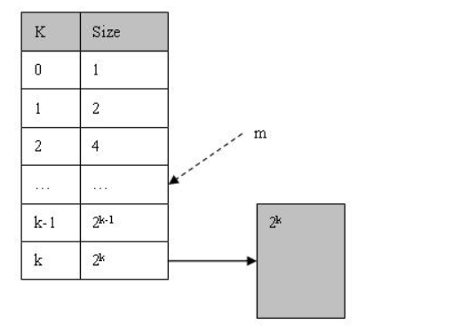
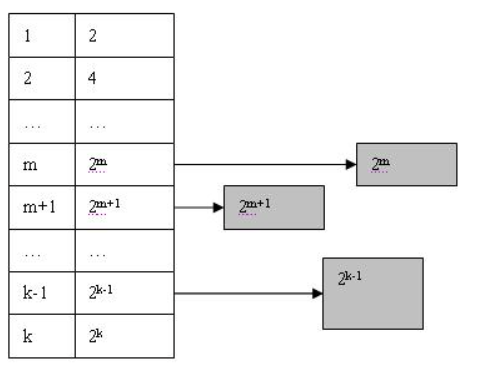
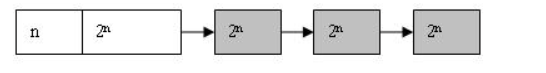
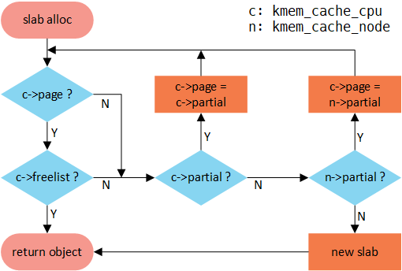
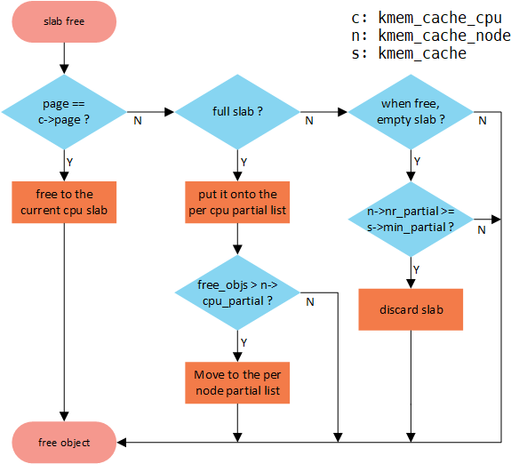

# lab2

# 练习一：first-fit 连续物理内存分配算法

## 1.First-Fit算法基本思想

First-Fit（首次适配）算法的核心思想是：从空闲内存块链表的头部开始查找，选择第一个足够大的块进行分配。算法的具体实现方法如下：
1. 从空闲内存块链表的头部开始查找，选择第一个足够大的块进行分配。
2. 分割找到的块为已分配块和剩余块。已分配块的大小为请求的大小，剩余块的大小为原块大小减去已分配块的大小。
3. 将剩余块插入到空闲内存块链表中，保持链表的有序性。

**First-Fit** 算法在由 `default_pmm.c` 实现。该模块通过维护按物理地址排序的空闲块链表（free list）管理连续物理页面（struct Page）。关键函数包括：   `default_init`、`default_init_memmap`、`default_alloc_pages`、`default_free_pages`。下面，我们来分析 **First-Fit** 算法的实现过程、各函数职责、边界与异常情形，并提出可能的改进方向。

## 2. 环境与数据结构

- `struct Page`：表示物理页框（frame），含有字段 `flags`、`property`、`ref` 和 `page_link`（用于链表链接）。
- `free_area_t`：包含 `free_list`（循环双向链表哨兵）和 `nr_free`（空闲页总数）。
- 链表宏 ： `list_init`、`list_add`、`list_add_before`、`list_next`、`list_prev`、`list_empty`这些函数实现了链表的创建、插入、删除等链表结构的功能，`le2page` 等函数用于将通用链表项转换为 `Page` 并进行插入/删除操作。

以上数据结构与宏为实现 **First-Fit** 算法提供了基础功能框架。

## 3. 函数逐一分析

### 3.1 `default_init(void)`

  `default_init(void)`函数初始化内存管理器，为对空闲链表执行 `list_init(&free_list)` 建立一个空的链表哨兵节点（这个节点并不存储具体的空闲页，而是作为一个特殊节点，维护链表结构），并将 `nr_free = 0`初始化空闲页计数。

### 3.2 `default_init_memmap(struct Page *base, size_t n)`

- 作用：将一段连续的物理页面初始化为一个空闲块并插入 `free_list`，同时更新 `nr_free`，实现了将空闲页加入空闲链表（free_list）的功能。
- 主要步骤：
	1. 判断空闲页数是否大于0（`n > 0`）。
	2. 对该区间内每个 `Page` 执行初始化：清除 `flags` 和 `property`，将 `ref` 设为 0（`set_page_ref(p, 0)`）。
	3. 在区间首页 `base` 上设置 `base->property = n` 并调用 `SetPageProperty(base)` 标记为空闲块的首页。
	4. 更新总空闲块的页数 （`nr_free += n`）。
	5. 按物理地址从低到高把空闲页 `base` 插入到 `free_list`（遍历链表找到第一个 `page` 满足 `base < page` 的位置并 `list_add_before`，若链表为空或`base`的地址比当前链表中的节点地址都要大则直接添加至链表末尾）。

- 功能总结：函数将整段连续物理页面作为一个“可分配的块”插入到空闲链表中。链表按地址排序便于后续合并空闲链表的相邻块。

### 3.3 `default_alloc_pages(size_t n)`

- 作用：从空闲链表中 **First-fit** 策略分配 `n` 个连续页面，若找到第一个可分配的空闲块，则返回分配基地址（`struct Page *`），若失败返回 `NULL`。
- 主要步骤：
	1. 若 `n > nr_free` 则直接返回 `NULL`（全局可用页不足）。
	2. 遍历 `free_list`（从头开始），对每个空闲块 `p` 检查 `p->property >= n`。
	3. 找到第一个满足条件的块 `p`：
		 - 从链表中删除该块的链表项 `list_del(&(p->page_link))`（使其脱离空闲链表）。
		 - 若 `p->property == n`：将 `p` 直接返回（整块被分配）。
		 - 若 `p->property > n`：将块分割，令 `q = p + n`（指向剩余部分），设置 `q->property = p->property - n`、`SetPageProperty(q)`，并把 `q` 插回到链表（通过 `list_add(prev, &(q->page_link))` 将剩余部分接到原来 `p` 的前驱之后，以保持排序）；返回 `p` 前 `n` 页作为已分配页。
	4. 更新 `nr_free -= n` 并清除被分配块的 `PageProperty` 标志（`ClearPageProperty(p)`）。

- 功能总结：首次适配策略选择第一个足以满足请求的空闲块，从而避免扫描全部链表，简单易实现。

### 3.4 `default_free_pages(struct Page *base, size_t n)`

- 作用：释放以 `base` 为起始、长度为 `n` 页的内存块，并在 `free_list` 中按地址顺序插入该空闲块，同时尝试与前后相邻空闲块合并以减少碎片。
- 主要步骤：
	1. 对要释放的每页：判断该页是否既未被保留也不已标记为 PageProperty；清除 `flags` 并 `set_page_ref(p,0)`。
	2. 在 `base` 处设置 `base->property = n`、`SetPageProperty(base)`，`nr_free += n`。
	3. 按地址序将 `base` 插入 `free_list`（若链表为空直接添加，否则遍历找到首个大于 `base` 的 `page` 并 `list_add_before`，否则加到末尾）。
	4. 尝试向前合并：取 `le = list_prev(&(base->page_link))`，若 `le != &free_list` 且前一块 `p` 满足 `p + p->property == base`（地址连续），则执行合并：`p->property += base->property`、`ClearPageProperty(base)`、`list_del(&(base->page_link))`、`base = p`（将 `base` 指向合并后的块，以便后续再尝试向后合并）。
	5. 尝试向后合并：取 `le = list_next(&(base->page_link))`，若存在后继块 `p` 且 `base + base->property == p` 则合并：`base->property += p->property`、`ClearPageProperty(p)`、`list_del(&(p->page_link))`。

- 功能总结：该函数保证空闲链表按物理地址排序并尽可能合并相邻空闲块，从而在释放时减少外部碎片。

## 4. 分配过程综述（运行时流程）

总体分配流程如下：

1. 系统启动时，`default_init` 初始化管理器数据结构；当可用物理内存区段被注册进系统时，`default_init_memmap` 将这些区段插入 `free_list` 并更新 `nr_free`。
2. 当需要分配 `n` 页时，调用 `default_alloc_pages(n)`：
	 - 从链表头开始线性扫描直至找到第一个 `property >= n` 的块；
	 - 若块等于请求大小，直接移除并返回；若块大于请求大小则分割，返回前半部分并将剩余部分重新链接回链表；
	 - 更新全局空闲页计数 `nr_free` 并清理已分配块的 `PageProperty` 标志。
3. 当释放时，`default_free_pages(base, n)` 将块信息（property、flags、ref）设置并按地址插入链表，然后尝试与前后相邻的块合并。

## 5. 复杂度与空间行为分析

- 分配复杂度（平均/最坏）：首次适配在最坏情况下需要遍历整个 `free_list`，时间复杂度为 O(m)，其中 m 是空闲块的数量。平均复杂度依赖于空闲块分布与请求模式，但通常优于在高度碎片化情况下的全链表扫描。分割与链表操作为 O(1)。
- 释放与合并复杂度：插入按照地址顺序需要线性扫描以找到插入点（O(m)），但合并本身为 O(1)（只检查邻居）。
- 空间效率：首次适配倾向于在低地址段产生更多小碎片（长期运行中可能降低可用性），但合并策略在释放时缓解了部分碎片问题。

## 6. 算法问题与改进方向

### 6.1 问题汇总

- 链表遍历成本：`alloc` 与 `free` 都需要在最坏情况下对空闲链表进行线性扫描，导致当空闲块数较大时性能下降。
- 碎片性：首次适配会导致低地址区域频繁分割产生小碎片，影响后续大块分配。
- 并发访问：该实现未考虑并发环境下对 `free_list` 的同步（在更复杂系统需加锁或采用 lock-free 结构）。

### 6.2 进一步的改进空间

1. 使用分级空闲列表（segregated free lists）或按大小分类的桶（bins）：将空闲块按大小范围放入不同链表，分配时只需查询合适桶，从而显著减少搜索成本。
2. 引入平衡树或二叉堆（如红黑树、size-ordered tree）：支持按块大小高效查询（best-fit、closest-fit），同时能在 O(log m) 时间内进行插入/删除。
3. 使用位图或 buddy allocator（伙伴系统）：对固定尺寸块的管理非常高效，分配与释放复杂度低且易于合并，对物理页管理（2^k 大小）比较适配。
4. 延迟合并或合并优化：目前每次释放都进行邻居检查并合并，可考虑按需合并或合并阈值以平衡释放成本。
5. 并发控制：在多核场景下，为避免全局链表争用，可采用 lock-free 结构，在分配页表和释放页表时加锁，避免并发分配页表与释放页表时出现冲突。

## 7. 结论

`default_pmm` 模块通过维持按物理地址排序的空闲块链表，实现了一个语义清晰且容易验证的首次适配分配器。其优点在于实现简单、合并操作便捷；缺点为在大规模/碎片化场景下存在搜索开销和潜在的内存碎片问题。

# 练习二：Best-Fit物理内存分配算法

## 1. 算法概述

**Best-Fit** 算法是一种物理内存分配策略，其核心思想是：在所有足够大的空闲块中选择最小的一个进行分配。这种方法试图最小化内部碎片，提高内存利用率。

在 **Best-Fit** 算法的实现中，我们可以参考 `default_pmm` 模块中的 **First-Fit** 算法实现，主要区别在于在`alloc_pages` 中选择空闲块时，需要遍历整个空闲链表，找到最小的块进行分配，而其他函数实现方式保持不变。

那下面我们就对`best_fit_alloc_pages`进行详细分析。

## 2.页面分配实现
`best_fit_alloc_pages`相比于`default_alloc_pages`的修改代码如下：
```c
// 遍历空闲链表寻找最小的足够大的块
while ((le = list_next(le)) != &free_list) {
    struct Page *p = le2page(le, page_link);
    if (p->property >= n) {
        if (page == NULL || p->property < page->property) {
                page = p;
        }
    }
}
```
**实现思路**：我们首先遍历空闲链表，找到第一个足够大的块，并保存在变量`page`中。然后，我们继续循环遍历链表，将新找到的块与当前的`page`的property进行比较，并将`page`更新为较小的空闲块，最终我们找到最小的块，并保存在`page`中。

## 4. Best-Fit与First-Fit的关键区别

1. 选择策略：
   - First-Fit：选择第一个足够大的块
   - Best-Fit：选择最小的足够大的块

2. 时间效率：
   - First-Fit：因为找到第一个符合条件的块就停止，所以其平均情况下搜索时间较短
   - Best-Fit：总是需要扫描整个空闲链表以找到最优块，时间开销较大

3. 空间效率：
   - First-Fit：容易在前端产生小碎片，但分配速度快
   - Best-Fit：产生的碎片大小最小，但可能会产生更多难以利用的小碎片

4. 实现复杂度：
   - First-Fit：实现简单，维护成本低
   - Best-Fit：需要完整遍历，实现略复杂

## 5. 算法改进分析

### 5.1 核心问题

当前Best-Fit实现面临两个主要挑战：性能开销和内存碎片。
* **性能代销**：每次分配都需要完整遍历链表（O(n)复杂度）来找到最适合的块，这在空闲块数量较大时会造成显著延迟。
* **内存碎片**：虽然算法选择最适合的块，但这可能导致产生大量难以利用的小碎片，同时现有的合并策略也存在优化空间。

### 5.2 改进方案

1. 数据结构优化
```c
// 分级空闲列表：按大小范围分类管理
struct SizeClass {
    size_t min_size;        // 该类别最小大小
    size_t max_size;        // 该类别最大大小
    struct AVLTree* blocks; // 使用平衡树存储该大小范围的块
};

// 平衡树节点：支持快速查找最佳匹配块
struct AVLNode {
    size_t size;           // 块大小
    struct Page* page;     // 对应的页面
    uint32_t height;       // 树高度
    struct AVLNode *left, *right;
};
```

这种结构将空闲块按大小范围分类，并在每个类别内使用平衡树存储，可以将查找时间从O(n)优化到O(log n)。当需要分配内存时，先确定大小类别（O(1)），然后在对应的平衡树中查找最小的足够大的块。

2. 内存碎片管理
```c
struct PageAllocator {
    SizeClass classes[N_CLASSES];    // 分级空闲列表
    struct {
        size_t split_threshold;      // 分割阈值
        size_t merge_threshold;      // 合并阈值
        struct Page* hot_cache;      // 热点大小缓存
    } policy;
};
```

通过引入分配策略控制：
- 设置分割阈值：当剩余碎片小于阈值时不进行分割，避免产生过小碎片
- 延迟合并：不是每次释放都立即合并，而是当碎片达到一定程度时才触发合并
- 维护热点缓存：对常用大小的块进行预分配和缓存

这些机制协同工作，可以显著减少碎片，提高内存利用率。

在多核环境下，该结构还可以扩展为每CPU一个分配器：
```c
struct PerCPUAllocator {
    struct PageAllocator local;     // 本地分配器
    struct SharedPool* shared;      // 共享池
    char pad[CACHELINE_SIZE];      // 避免false sharing
};
```

这种设计不仅提高了性能，还通过本地缓存和共享池的分层结构降低了并发冲突。当本地分配器资源不足时，才需要与其他CPU竞争共享资源。

## 6. 结论

Best-Fit算法通过选择最适合的空闲块来优化空间利用率，但存在时间效率的问题。通过引入索引结构、优化数据结构和改进并发处理，可以在保持其空间效率优势的同时提高时间效率。

## 扩展练习Challenge：buddy-system（伙伴系统）分配算法
前面介绍的best-fit和first-fit，我们发现虽然它们能够较好地利用内存，但仍存在以下问题：

- 外部碎片问题（External Fragmentation）：
随着内存的频繁分配和释放，空闲空间被切割得越来越零散，无法满足较大的分配请求，即使总空闲空间足够。

- 合并效率低：
在释放内存时，需要遍历整个空闲链表来寻找相邻空闲块，合并过程复杂且耗时。

为了解决上述两个问题，我们特别想要尝试一种新的内存分配方式，来更好地平衡和解决这两个问题。这里我们提出**Buddy System**伙伴分配算法。

**Buddy System（伙伴系统）** 是一种兼顾内存利用率与管理效率的动态内存分配算法。
它的核心思想是：

> 将整个可用内存区域划分为若干个大小为 2 的幂次方的块（block），并通过“伙伴关系”快速进行分裂与合并。


首先我们简单介绍一下伙伴内存的结构，
Buddy System把系统中的可用存储空间划分为存储块(Block)来进行管理, 每个存储块的大小必须是2的n次幂(Pow(2, n)), 即1, 2, 4, 8, 16, 32, 64, 128...
假设系统全部可用空间为Pow(2, k), 那么在Buddy System初始化时将生成一个长度为k + 1的可用空间表List, 并将全部可用空间作为一个大小为Pow(2, k)的块挂接在List的最后一个节点上, 如下图:



当用户申请size个字的存储空间时, Buddy System分配的Block大小为Pow(2, m)个字大小(Pow(2, m-1) < size < Pow(2,  m)).
此时Buddy System将在List中的m位置寻找可用的Block. 显然List中这个位置为空, 于是Buddy System就开始寻找向上查找m+1, m+2, 直到达到k为止. 找到k后, 便得到可用Block(k), 此时Block(k)将分裂成两个大小为Pow(k-1)的块, 并将其中一个插入到List中k-1的位置, 同时对另外一个继续进行分裂. 如此以往直到得到两个大小为Pow(2, m)的块为止, 如下图所示:




如果系统在运行一段时间之后, List中某个位置n可能会出现多个块, 则将其他块依次链接可用块链表的末尾:





当Buddy System要在n位置取可用块时, 直接从链表头取一个就行了.当一个存储块不再使用时, 用户应该将该块归还给Buddy System. 此时系统将根据Block的大小计算出其在List中的位置, 然后插入到可用块链表的末尾. 在这一步完成后, 系统立即开始合并操作. 该操作是将"伙伴"合并到一起, 并放到List的下一个位置中, 并继续对更大的块进行合并, 直到无法合并为止.
何谓"伙伴"? 如前所述, 在分配存储块时经常会将一个大的存储块分裂成两个大小相等的小块, 那么这两个小块就称为"伙伴".在Buddy System进行合并时, 只会将互为伙伴的两个存储块合并成大块, 也就是说如果有两个存储块大小相同, 地址也相邻, 但是不是由同一个大块分裂出来的, 也不会被合并起来. 正常情况下, 起始地址为p, 大小为Pow(2, k)的存储块, 其伙伴块的起始地址为: p + Pow(2, k) 和 p - Pow(2, k).


总之，伙伴系统的优点是算法简单、速度快；缺点是由于只归并伙伴而容易产生碎片。

接下来，我就从代码实现的角度来分析一下这个程序，根据网上对于Buddy System的介绍，我从链表和二叉树数组两个方向完成了这个任务。首先，我重点从链表的角度介绍一下设计。

### 核心数据结构与边界设定

* 阶（order）上限：`MAX_ORDER=20`，以页为粒度（默认 4KB），最大块大小为 `2^20` 页 ≈ 4GB。这个值只约束“单块的最大阶”，并不限制总可管理页数（`total_pages` 可远大于 `2^20`，此时会有很多 `MAX_ORDER` 的块链表节点）。
* 空闲链表：`free_list[0..MAX_ORDER]`，每个阶一个循环双链表（`list_entry_t`），配合 `nr_free[i]` 保存块数量，便于 O(1) 得到某阶空闲块数。
* Page 复用为元数据：块首页（header）的 `property=order` 且 `PageProperty=1`，非首页不设该标记。做到零额外内存开销，完全嵌入式。
* 全局范围：`buddy_base` 和 `total_pages` 定义了管理的“连续页区间”。所有索引、伙伴定位都以 `buddy_base` 为 0 号页基准。

### 初始化流程（`buddy_init` / `buddy_init_memmap`）
```c
static void
buddy_init(void) {
    // 初始化所有空闲链表
    for (int i = 0; i <= MAX_ORDER; i++) {
        list_init(&free_list[i]);
        nr_free[i] = 0;
    }
    buddy_base = NULL;
    total_pages = 0;
}

static void
buddy_init_memmap(struct Page *base, size_t n) {
    assert(n > 0);
    
    buddy_base = base;
    total_pages = n;
    
    // 初始化所有页面
    for (size_t i = 0; i < n; i++) {
        struct Page *p = base + i;
        assert(PageReserved(p));
        p->flags = 0;
        p->property = 0;
        set_page_ref(p, 0);
    }
    
    // 将内存分解成不同大小的块加入空闲链表
    // 策略：贪心地分配尽可能大的块
    size_t remaining = n;
    struct Page *current = base;
    
    while (remaining > 0) {
        // 找到不超过 remaining 的最大 2 的幂
        size_t order = 0;
        while ((1UL << (order + 1)) <= remaining && order < MAX_ORDER) {
            order++;
        }
        
        size_t block_size = (1UL << order);
        
        // 设置块的属性
        current->property = order;  // property 存储阶数
        SetPageProperty(current);    // 标记为块首页
        
        // 加入对应阶的空闲链表
        list_add_before(&free_list[order], &(current->page_link));
        nr_free[order]++;
        
        current += block_size;
        remaining -= block_size;
    }
}
```


* `buddy_init`：清空各阶链表及计数器。
* `buddy_init_memmap(base, n)`：

  * 把 `[base, base+n)` 区间的页面清空状态（清 flags、ref、property），并记录全局基址与总页数。
  * **关键点：二进制分解式建堆**
    用“尽可能大的 2 的幂”块从低地址向高地址贪心切分 `n` 页：
    例如 `n=13` 页 → 8 + 4 + 1 三个块，分别挂到 `order=3、2、0` 的空闲链表。
    由于从 `buddy_base`（索引 0）开始累进，任意 `2^k` 大小的块起始索引必然满足 `start % 2^k == 0`，从而天然满足 buddy 对齐要求，即使 `n` 本身不是 2 的幂也不影响。
  * 每个块只在**块首页**设置 `property=order` 与 `PageProperty` 标记并入链表，其他页为普通空闲页。

> 特别要注意的是，为了一定程度上修正Buddy System内部碎片的问题，方案正确地把“非 2 的幂”的物理区间切成若干个对齐的幂次块，满足后续 buddy 算法的假设。

### 分配流程（`buddy_alloc_pages(n)`）
```c
buddy_alloc_pages(size_t n) {
    assert(n > 0);
    
    if (n > total_pages) {
        return NULL;
    }
    
    // 计算需要的阶数（向上取整到2的幂）
    size_t order = order_of_size(n);
    
    if (order > MAX_ORDER) {
        return NULL;
    }
    
    // 从 order 开始查找空闲块
    size_t current_order = order;
    while (current_order <= MAX_ORDER) {
        if (!list_empty(&free_list[current_order])) {
            // 找到空闲块
            list_entry_t *le = list_next(&free_list[current_order]);
            struct Page *page = le2page(le, page_link);
            list_del(le);
            nr_free[current_order]--;
            ClearPageProperty(page);
            
            // 如果块太大，需要分裂
            while (current_order > order) {
                current_order--;
                size_t buddy_size = (1UL << current_order);
                struct Page *buddy = page + buddy_size;
                
                // 设置分裂出的右半部分
                buddy->property = current_order;
                SetPageProperty(buddy);
                list_add(&free_list[current_order], &(buddy->page_link));
                nr_free[current_order]++;
            }
            
            // 清理分配出去的页面
            for (size_t i = 0; i < n; i++) {
                struct Page *p = page + i;
                p->flags = 0;
                set_page_ref(p, 0);
            }
            
            return page;
        }
        current_order++;
    }
    
    return NULL;  // 没有足够的内存
}
```
* 需求阶计算：`order_of_size(n)` 近似 `ceil(log2(n))`。实现用迭代 `(size+1)/2` 直到 1，**对 1、2、3、…、5 等都能得到正确阶**（如 `n=3→order=2`）。
* 选择块：从 `current_order=order` 开始往上找**首个非空**链表；找到后取出一个块，清除其 `PageProperty`（不再是空闲块）。
* 逐级拆分：若拿到的块阶比目标大，则**只对右半部分**形成空闲块：

  * 令 `current_order--`，右半块起始 `buddy = page + (1 << current_order)`；
  * 为右半块设置 `property=current_order` 和 `PageProperty`，入 `free_list[current_order]`。
  * 重复直到降到目标阶。
* 清理页状态：代码仅对前 `n` 页清 flags/ref。**注意**：实际分配的最小单位是 `2^order` 页；理想状况是清理整个 `2^order`，但只清 `n` 也不会破坏正确性（详见“改进建议”）。

**复杂度**：

* 最坏找到可用阶 O(MAX\_ORDER)（常量 21）；
* 拆分次数最多 O(MAX\_ORDER)；
* 因而分配整体 O(log N)（N≈总页数）。

### 释放与合并（`buddy_free_pages(base, n)`）
对于这个函数：
* `base` 必须是之前通过 `alloc_pages` 返回的**块首地址**（即当时分配的左半块首页）。
* `n > 0`，且**调用者传回的 n 对应的阶**与当初分配时的阶一致（或“同阶等价”，例如分配 3 页→上取整 4 页；回收传 `n=3`、`n=4` 都对应 `order=2`，可视为一致）。
* 管理区间 `[buddy_base, buddy_base + total_pages)` 已在 `buddy_init_memmap` 初始化。

在回收目标时，

* 恢复该块到空闲链表，**若伙伴满足条件则多级合并**，以减少外部碎片。
* 保持不变量：

  1. 空闲链只挂**块头**；
  2. 块头 `property == order`；
  3. `nr_free[order]` 与链表元素数相符；
  4. 区间安全与对齐安全。
接下来我们逐行进行分析，

#### 基本卫护

```c
assert(n > 0);
if (buddy_base == NULL || base < buddy_base || base >= buddy_base + total_pages) {
    return;  // 非法地址
}
```

* 短路拒绝**未初始化**或**越界释放**。这里“return”而非“assert”有更强的容错性（不崩溃内核）；但也意味着**双重释放/野指针**不会当场爆雷（见 §6 风险）。

#### 求阶与对齐约束

```c
size_t order = order_of_size(n);
size_t block_size = (1UL << order);
size_t page_idx = base - buddy_base;

if (page_idx & (block_size - 1)) {
    return;  // 未对齐，非法释放
}
```

* `order_of_size` 等价 `ceil(log2(n))`：即把 n 上取整到最小 2^k。
* **对齐检查的本质**：任何 `2^k` 大小的块，其块头索引必满足 `page_idx % 2^k == 0`。

  * 这一步将大量“错误 n”拦截掉：若调用者传了更小阶（如本应 2^4=16 页，却传 n=9→order=4 仍能通过），则**仍可能误过检**；但若传的阶更大（n→order 更大），对齐极易失败被拒绝。


#### 伙伴定位与合并循环

```c
struct Page *page = base;

while (order < MAX_ORDER) {
    size_t buddy_idx = page_idx ^ (1UL << order);
    if (buddy_idx >= total_pages) break;

    struct Page *buddy = buddy_base + buddy_idx;

    if (!PageProperty(buddy) || buddy->property != order) {
        break;  // 伙伴不空闲或大小不匹配
    }

    list_del(&(buddy->page_link));
    nr_free[order]--;
    ClearPageProperty(buddy);

    if (page_idx > buddy_idx) {
        page = buddy;         // 低地址作为新块头
        page_idx = buddy_idx;
    }

    order++;
    block_size <<= 1;
}
```

* 在 Buddy 中，**同阶块**以 `2^order` 为粒度分组，**组内一对**相邻块的索引仅在第 `order` 位不同。
* 把块头索引 `page_idx` 的第 `order` 位取反，即 `page_idx ^ (1<<order)`，得到**同组另一半**块的块头索引。
* 因为 `page_idx` 已保证 `2^order` 对齐（低 `order` 位为 0），所以 `buddy_idx` 必然也是 `2^order` 对齐，且两者相邻、共同组成一个 `2^(order+1)` 超块。

#### 两个必要条件确保“只对合法伙伴合并”

1. `PageProperty(buddy)`：伙伴**必须是空闲块头**。
2. `buddy->property == order`：伙伴**必须是同阶**。

   * 这可阻断“把正在被拆分、或不同阶零散块误当伙伴”的情况。

#### 合并后的块头选择

* 取**低地址**作为新块头：

  * 这样新块头仍满足 `2^(order+1)` 对齐（因为两个 `2^order` 头索引仅在该位不同，低地址必把该位清零），不变量得以递归保持。

在终止条件的完整性上，我们保证：

* 越界（`buddy_idx >= total_pages`）→停；
* 伙伴不空闲/不同阶→停；
* 达到 `MAX_ORDER`→停。
* **单调性**：每次合并 `order++`，块大小翻倍，循环**最多 O(log N)** 次。

#### 回挂与计数

```c
page->property = order;
SetPageProperty(page);
list_add(&free_list[order], &(page->page_link));
nr_free[order]++;
```

* 将合并后的**最终块头**入对阶链，恢复 `PageProperty`。
* 计数与链表同步更新，保证 `buddy_nr_free_pages()` 的可加总一致性。


接下来我们从理论上分析一下这个策略的正确性：
1. **对齐充要**：
   若 `base` 是一个 `2^k` 大小块的块头，则 `page_idx % 2^k == 0`；反之，一个满足该对齐的 `page_idx` 若由 `alloc_pages` 产生，必为某级块头（在“无非法写”的假设下）。
2. **伙伴闭包性**：
   若两个 `2^k` 块头 `i` 与 `j` 的索引只在第 `k` 位不同（即 `j = i ^ 2^k`），且二者空闲，则合并生成的 `2^(k+1)` 超块其块头为 `min(i, j)`，必 `2^(k+1)` 对齐。
3. **不变量保持**：
   合并前把伙伴从链表移除并计数 `--`；合并结束后把新块头入链计数 `++`。每轮保持“链表元素 × 块大小”的总页数不变，直到回收结束。
4. **无交叉合并**：
   由于每次只会与**唯一 XOR 伙伴**匹配，且要求伙伴同阶、空闲，因此不会与其他块交叉合并，避免“多源汇聚”。


接下来我们分析一下时空复杂度：

* **时间**：

  * 定位伙伴 + 条件检查：每阶 O(1)；
  * 最多合并到 `MAX_ORDER`：O(log N)。
* **空间**：

  * 不新增 per-block 结构，复用 `struct Page` 中 `property` 与 `PageProperty` 位；
  * 仅调整链表指针，O(1)。


### 统计（`buddy_nr_free_pages`）
```c
buddy_nr_free_pages(void) {
    size_t total = 0;
    for (int i = 0; i <= MAX_ORDER; i++) {
        total += nr_free[i] * (1UL << i);
    }
    return total;
}
```
* 通过 `Σ nr_free[i] * (1<<i)` 计算总空闲页数，**与 buddy 结构一致**，不会漏算。

### 自测用例（`buddy_check`）
为了验证正确性，我写了一个基础的自测用例，用于验证我的内存模型设计正确性，具体地说，这个测试用例涵盖了以下的内容：
* 分配/释放基本正确性（Test 1），并核对 `nr_free_pages()` 前后相等。
* **非 2 的幂**请求（Test 2）：3→4，5→8，7→8，验证向上取整策略。
* 伙伴合并（Test 3）：先分配 4×1 页，按伙伴对释放，随后能拿到 2 页连续块。
* **内存耗尽**（Test 4）：尝试超过可用页数或“吃光”所有可用页；覆盖超配失败与“完全占满后再次分配失败”的路径。
* 边界值（Test 5）：1 页与较大块（16 页）。
* 碎片-整理（Test 6）：制造碎片、验证在进一步释放后能申请更大连续块。
* 顺序性（Test 7）：检查是否大致按地址递增（Buddy 不保证严格顺序，因此“INFO 可接受”的判断合理）。

整体来看，测试覆盖了核心路径与若干边界情形，基本扎实。

除此之外，考虑到传统链表版在释放阶段强依赖调用者提供正确的 n 值、以及当内存规模较大时链表维护的分散性问题，我还设计了一个基于完全二叉树的 Buddy System 实现，旨在通过统一的数组结构显式记录每个子树的最大可用块大小，从而在 O(log N) 时间内完成分配与合并操作，同时避免对调用参数 n 的依赖，提升算法的鲁棒性与诊断性。

接下来，我将重点讲解这两种 Buddy System 的不同设计思路、数据结构组织方式以及它们在空间开销、回收策略、可扩展性等方面的权衡与优缺点分析。


#### 状态表示（`buddy_tree[]` = “最长可用”段）


* 用一棵“**虚拟满二叉树**”覆盖 `buddy_tree_pages = 2^k` 个叶子，每个节点存该子树“**最大可用连续块大小**”（单位：页），非 2 的幂通过补虚拟叶（置 0）兜底。
* 与“多条空闲链（按阶）”不同，这里**只有一份数组**，通过“最长”信息在 O(logN) 时间里导引到可分配节点。

**关键代码**

* 初始化“满二叉树”并按层赋值（根最大，往下对半）：

  ```c
  unsigned node_size = buddy_tree_pages * 2;
  for (size_t i = 0; i < buddy_tree_size; i++) {
      if (IS_POWER_OF_2(i + 1)) node_size /= 2;
      buddy_tree[i] = node_size;
  }
  ```
* 把越界叶（补出来的虚拟页）置 0，**并回溯刷新**所有祖先的“最长”：

  ```c
  if (buddy_tree_pages > actual_pages) {
      for (size_t i = actual_pages; i < buddy_tree_pages; i++) {
          unsigned idx = i + buddy_tree_pages - 1;
          buddy_tree[idx] = 0;
      }
      // 回溯刷新祖先
      ...
  }
  ```

* “最长值”是一种**贪心导航指标**：只需看左右子最大谁能满足就往哪走，不必列举每阶链表。
* 溢出页置 0 + 回溯，保证“非幂规模”区间不会被错误分配。
* 树的空间开销约 `2 * 2^k - 1 ≈ 2N` 个 `unsigned`，比“链表+page 元数据”**更整洁，且无 per-order 头结点**。


#### 分配路径（`buddy_alloc_pages`）

* 需求 `n` **上取整**到 `size = 2^order`（这是标准 Buddy 语义）。
* 自根向下，**先看左子**是否能满足（“最长”>= `size`），能则下左，否则下右；直到命中恰好 `node_size == size` 的节点。
* 命中节点置 0（表示该子树没有可用块），**向上回溯**父节点的“最长 = max(左右)”即可。

**关键代码**

```c
unsigned size = fixsize(n);
if (buddy_tree[0] < size) return NULL; // 根不够

unsigned index = 0, node_size = buddy_tree_pages;
for (; node_size != size; node_size /= 2) {
    unsigned l = LEFT_LEAF(index), r = RIGHT_LEAF(index);
    index = (buddy_tree[l] >= size) ? l : r;
}

// 命中节点置 0
buddy_tree[index] = 0;

// 回溯刷新祖先“最长”
while (index) {
    index = PARENT(index);
    buddy_tree[index] = MAX(buddy_tree[LEFT_LEAF(index)], buddy_tree[RIGHT_LEAF(index)]);
}
```

* **左优先**使地址偏向低端，利于整体“紧凑”并提升大块成功率（但不保证严格递增）。
* **时间复杂度 O(logN)**，只走树高，和“多阶链表里找第一个可用块”复杂度相当但更规整。
* **映射 index→页偏移**用的是

  ```c
  offset = (index + 1) * node_size - buddy_tree_pages;
  ```

  这来自满二叉树“层次序索引”的叶区起点在 `[buddy_tree_pages-1, ...]` 的性质（可视作标准堆数组 + 子树跨度）。

#### 释放与合并（`buddy_free_pages`）


* 与“链表版本”按 `order`/对齐去找**唯一 XOR 伙伴**不同，二叉树版**不依赖传入 n**：从“叶对应索引”一路往上，**找到第一个 `buddy_tree[index] == 0` 的节点**，这就是当初**整块分配**时置 0 的那个节点。
* 把该节点恢复为其 `node_size`，再**自底向上**地做“**两子都满**则合并，否则取 `max(left,right)`”。

**关键代码**

```c
unsigned node_size = 1;
unsigned index = (base - buddy_base) + buddy_tree_pages - 1;

// 向上找到“当初被分配”的节点：第一个 longest==0
for (; buddy_tree[index] != 0; index = PARENT(index)) {
    node_size *= 2;
    if (index == 0) return; // 没找到：重复释放或参数错误
}

// 复原该节点为“满空闲”
buddy_tree[index] = node_size;

// 回溯合并
while (index != 0) {
    unsigned parent = PARENT(index);
    node_size <<= 1;
    unsigned L = buddy_tree[LEFT_LEAF(parent)];
    unsigned R = buddy_tree[RIGHT_LEAF(parent)];
    buddy_tree[parent] = (L + R == node_size) ? node_size : MAX(L, R);
    index = parent;
}
```

* “**first-zero** 节点即当初分配点”这一性质成立的关键：**分配时只把命中节点置 0，而不去改动子树更低层的叶/子**，因此自叶往上总会在**块边界**处撞到 0。
* 释放时没有显式 `order` 概念，**支持 n≠2^k 的传参**（你也在注释里说明了 3/4、5/8 的“同阶等价”）。


#### 统计方法
为了稳健地统计空闲页数，我选择使用递归统计的方式保证结果的正确性，具体算法流程如下：

对任意节点 u（子树容量为 S(u)），记该子树的真实空闲页总数为 F(u)。你递归函数返回 G(u)。

若 buddy_tree[u] == 0：根据维护规则，这代表“整棵子树无空闲”，F(u)=0；函数返回 0，所以 G(u)=F(u)。

若 buddy_tree[u] == S(u)：根据维护规则，这代表“整棵子树全空闲”，F(u)=S(u)；函数返回 S(u)，所以 G(u)=F(u)。

若 0 < buddy_tree[u] < S(u)：根据维护规则，“部分空闲”，函数递归两子 l,r，返回 G(l)+G(r)；
由结构归纳假设 G(l)=F(l), G(r)=F(r)，故 G(u)=F(l)+F(r)=F(u)。

根节点 root 也满足上述三种情形之一，因此 G(root)=F(root)，即递归返回的就是系统总空闲页数。

注意这也解释了为什么不需要在最后再 min(total_free, actual_pages)：只要树维护不变量成立，G(root) 就等于真实空闲总页数，自然 ≤ actual_pages。如果出现更大的值，说明树状态坏了，应该暴露问题而不是被截断掩盖。

完整的两份代码请查看仓库代码。到此为止，我们的伙伴内存分配器就设计完毕了！
# 扩展练习Challenge：任意大小的内存单元SLUB分配算法

## 1. SLUB分配算法理论基础

SLUB（Single Level Unqueued Blocks）分配器是一种高效的内存管理机制，其理论基础建立在对象缓存和内存池管理的基础之上。该算法通过实现分层次的内存管理结构，在保证内存分配效率的同时，有效降低了内存碎片化程度。

### 1.1 理论模型

SLUB分配器的理论模型基于以下两个关键概念：

1. **对象缓存层次结构**：将内存空间按照对象大小进行分层管理，每层维护固定大小的内存块集合。这种层次化设计能够显著降低内存分配的搜索开销，并提供近似O(1)的分配时间复杂度。

2. **批量内存管理策略**：采用页面级别的内存块（slab）作为基本管理单元，每个slab包含多个相同大小的对象。这种策略通过减少内存管理操作的频率，有效降低了系统开销，同时提高了缓存利用率。

## 2. 核心数据结构

SLUB分配器的架构设计采用了分层式的内存管理结构，通过精心设计的数据结构实现了高效的内存分配和回收机制。

在SLUB分配器中，内存管理的核心围绕两个关键数据结构展开：

```c
struct slub_cache {
    list_entry_t slub_list;     /* slab可用队列 */
    list_entry_t full_list;     /* slab完全分配队列 */
    struct Page* partial;       /* 部分分配slab指针 */
    uint32_t objsize;          /* 对象大小 */
    uint32_t num;              /* 每个slab的对象数量 */
    uint32_t offset;           /* 对象偏移量 */
    uint32_t free_objects;     /* 空闲对象计数 */
    uint32_t total_objects;    /* 总对象计数 */
};
```

这个结构实现了对象缓存的核心管理功能，采用分离式链表管理策略，有效区分了不同状态的内存块，从而优化了内存分配的查找过程。其中，`objsize`和`num`的设计体现了SLUB分配器对内存对齐和空间效率的权衡考虑。

```c
struct slub_page {
    void* freelist;           /* 空闲对象链表 */
    uint32_t units;          /* 已分配对象计数 */
    struct Page page;        /* 基础页面结构 */
};
```

此结构通过扩展基础页面管理，实现了高效的对象级内存管理。其中，`freelist`字段指向空闲对象链表，`units`字段记录已分配对象数量，从而支持高效的内存分配和释放操作。

## 3. 核心算法实现分析

SLUB分配器的实现围绕内存的初始化、分配和释放三个核心操作展开，我们将逐一分析这些操作的实现细节。

### 3.1 初始化机制

SLUB分配器的初始化过程实现了缓存系统的基础构建，其核心算法如下：

```c
static void slub_init(void) {
    list_init(&cache_chain);
    
    for (int i = 0; i < SIZED_CACHE_NUM; i++) {
        sized_caches[i].objsize = sized_cache_sizes[i];
        slub_cache_init(&sized_caches[i]);
    }
    
    nr_free = 0;
    slub_cache = &sized_caches[0];
}
```

此初始化过程采用分层初始化策略，建立了一个多层次的缓存结构，为后续的内存分配操作提供了高效的基础架构。

### 3.2 内存分配算法

内存分配算法是SLUB分配器的核心，其实现体现了高效性和可扩展性的平衡：

```c
static struct Page* slub_alloc_pages(size_t n) {
    if (n > nr_free) return NULL;
    
    struct slub_cache *cache = slub_cache;
    struct Page *page = NULL;
    
    if (cache->partial != NULL) {
        page = cache->partial;
        void *object = page->freelist;
        page->freelist = *(void **)object;
        page->units++;
        
        if (page->units == cache->num) {
            cache->partial = NULL;
            list_add(&cache->full_list, &(page->page_link));
        }
    } else {
        page = alloc_page();
        if (page != NULL) {
            cache->total_objects += cache->num;
            setup_slub_page(cache, page);
        }
    }
    
    if (page != NULL) {
        nr_free -= n;
        ClearPageProperty(page);
    }
    return page;
}
```


该算法实现了基于状态的内存分配策略，其核心机制是通过维护slab的三种状态（部分分配、完全分配和空闲）来优化内存分配过程。具体而言，当系统接收到内存分配请求时，算法遵循以下分配原则：

首先，算法会优先从部分分配（partial）的slab中分配内存，这种策略有效利用了已经激活的内存页面，不仅减少了内存碎片，还提高了缓存的命中率。当partial slab中的对象被完全分配后，该slab会自动转换为完全分配（full）状态，并被移至full_list中管理。

如果没有可用的partial slab，系统则会创建新的slab页面，此过程涉及物理页面的分配和初始化，包括设置对象布局、构建空闲对象链表等操作。这种动态创建机制确保了系统能够根据实际需求扩展内存池，同时保持了较高的内存使用效率。

### 3.3 回收算法

SLUB分配器的内存释放过程的核心在于如何高效地管理对象的生命周期、维护slab的状态一致性。


```c
static void slub_free_pages(struct Page *base, size_t n) {
    struct slub_cache *cache = slub_cache;
    
    // 重置页面基本属性
    base->flags = 0;
    set_page_ref(base, 0);
    
    // 计算对象地址并获取slub控制结构
    void *object = page2kva(base) + cache->offset;
    struct slub_page *slub = (struct slub_page *)page2kva(base);
    
    // 将释放的对象添加到空闲链表
    *(void **)object = slub->freelist;
    slub->freelist = object;
    slub->units--;
    
    // 根据使用情况更新slab状态
    if (slub->units == 0) {
        // slab完全空闲，从链表中移除
        list_del(&(base->page_link));
        cache->free_objects += cache->num;
    } else if (slub->units == cache->num - 1) {
        // slab变为部分使用状态
        list_del(&(base->page_link));
        cache->partial = base;
    }
    
    nr_free += n;
}
```


该释放算法通过以下几个关键步骤实现了高效的内存回收：

首先，通过重置页面的基本属性（`flags = 0`和引用计数清零），确保页面能够安全地进入可重分配状态。释放算法采用LIFO（后进先出）策略来管理空闲对象链表，这种方式不仅通过简单的指针操作（`*(void **)object = slub->freelist`）实现了O(1)时间复杂度的对象插入，还有效地维护了内存访问的空间局部性。

在内存释放代码的算法中最关键的是其动态的状态管理机制：当一个slab的已用对象数（`units`）降为0时，该slab被完全回收；当`units`达到`cache->num - 1`时，slab则转移到partial状态，这种基于使用率的精确状态转换确保了内存的高效利用，同时最小化了内存碎片。

上述内存释放算法通过巧妙的状态转换设计和高效的链表操作，实现了快速的内存释放和对象重用，并保持了系统的内存使用效率。


## 4. 总结

我们的SLUB分配器通过分层次内存管理机制，实现了以下优势：

1. 高效的内存分配策略
2. 优化的缓存局部性
3. 可扩展的架构设计

通过这些优化，SLUB分配器将能更好地适应现代计算系统的需求。

在操作系统无法从设备树或固件获取物理内存信息时，需要通过主动探测的方式确定可用的物理内存范围。下面将详细介绍一种基于位模式测试的高效内存探测方法。

# 扩展练习Challenge：硬件的可用物理内存范围的获取方法

如果操作系统（OS）或其引导加载程序（Bootloader）在启动初期无法通过BIOS/UEFI等固件接口提前获取物理内存的布局信息，它必须主动进行 **内存探测（Memory Probing）** 来确定可用物理内存的起始地址和结束地址。这个过程的核心思想，是通过向内存地址写入特定的位模式并回读校验，从而判断该地址是否对应着真实、可用的物理内存。

这套探测机制可以归纳为一个连续的“ 写入-回读-验证 ”的循环过程。OS会从一个已知的、肯定存在的低地址（例如物理地址0）开始，逐步向高地址进行探测。在每一个探测的地址上，它会执行一系列操作来确认内存的有效性和可靠性。

为什么“ 写入-回读-验证 ”的整个过程就能够说明这段内存地址是可用的？因为从一个无效地址（浮动总线）上恰好读回我们试图写入的一段内容的概率非常低。因此，当我们写入一段内容并能稳定地读回一段内容时，就建立了一个强有力的证据：这个地址背后有一个能可靠存储并返回数据的物理设备，也就是内存。

为了确保探测的准确性，仅仅使用单一的数据模式（如全0或全1）是不够的，因为它可能无法检测出所有类型的硬件故障，例如数据线之间的短路或某些位“卡死”在0或1的状态。因此，我们需要采用更严谨的测试模式，其中最经典的就是互补位模式测试：OS会对一个内存单元执行以下操作：

1. 写入第一个模式：向该内存地址写入 0xAA（二进制为 10101010）。这个模式的特点是相邻位完全相反。

2. 验证第一个模式：立即从该地址读出数据，检查是否仍然是 0xAA。如果不是，说明此内存地址无效或存在故障。

3. 写入互补模式：如果上一步通过，再向同一地址写入 0x55（二进制为 01010101）。0x55 正好是 0xAA 的二进制反码。

4. 验证互补模式：再次立即读出数据，检查是否为 0x55。

通过这一对互补模式的测试，可以有效地检测出大部分常见的内存硬件问题。如果一个内存地址成功通过了这一系列的读写校验，OS就将其标记为“可用”。


OS会不断重复这个探测过程，依次递增内存地址（通常以页或更大的块为单位以提高效率）。当探测到一个写入和回读结果不一致的地址时，通常就意味着遇到了物理内存的边界，或者是一个无效的内存空洞、以及映射给硬件设备（MMIO）的地址空间。通过记录下最后一个成功的地址，OS就能确定这段连续物理内存的上限，从而构建出整个系统的物理内存映射图（Memory Map），为后续的内存管理初始化工作打下基础。
