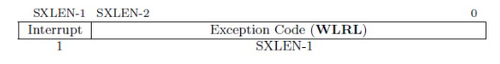

# lab3
## Challenge 2：理解上下文切换机制
### 练习要求
回答：在trapentry.S中汇编代码 csrw sscratch, sp；csrrw s0, sscratch, x0实现了什么操作，目的是什么？save all里面保存了stval scause这些csr，而在restore all里面却不还原它们？那这样store的意义何在呢？

### 回答
首先我们先来看两条指令的作用：
 **`csrw sscratch, sp`**，这条汇编语句的意义是把**进入陷入时**的栈指针 `sp` 暂存到 CSR `sscratch`。这样在马上要为 trapframe 腾出空间、移动 `sp` 之前，先把“原始的 `sp`”备份到一个寄存器（`sscratch`）里。使用这一指令是由于CSR是特权寄存器，因此RISCV不能直接从CSR写到内存, 需要csrr把CSR读取到通用寄存器，再从通用寄存器STORE到内存，csrw指令可以直接把通用寄存器的值写入CSR，因此我们选择使用csrw指令把sp的值写入sscratch寄存器中。

然后我们讲解下一条指令 **`csrrw s0, sscratch, x0`**，这是一条“读并交换”CSR 的三元的RISC-V原子指令：把 `sscratch` 的旧值读到 `s0`，同时把存在x0寄存器中的**0**值 写回 `sscratch`。

我们使用这两条指令的最终结果是： `s0` 里拿到**进入陷入前的原始 `sp`**，随后用 `STORE s0, 2*REGBYTES(sp)` 把它存入 trapframe 对应的 `sp` 槽位（即 `pushregs.sp`）。 sp是“被打断上下文”的栈指针，我们需要把它保存下来，以便后续恢复现场时能回到正确的栈位置。如果什么都不做就改 sp，就丢失了“原始 sp”。因此先用一个不受当前栈移动影响的地方暂存它，最方便、最低开销的就是一个 CSR：sscratch。

随后把 `sscratch` 清零，**作为“我们现在处于内核陷入路径”的标记**。如果在保存现场过程中又发生“递归异常/中断”，入口代码可通过 `sscratch==0` 快速判断这次 trap 是发生在内核态的陷入处理里，从而走一条更稳妥的兜底路径（例如使用一个保底栈/只做最小化处理/直接 panic 等，而不是按用户/普通上下文那套流程再起一遍大栈框）。

我们看一个常见时序：我们刚进 __alltraps，执行了 csrw sscratch, sp，随后 addi sp, sp, -...、一通 STORE 在改动当前栈。万一这时又发生一次异常（比如栈越界/页失效/对齐错误/取指异常等），入口代码需要判定：

- 这是来自“普通上下文”（比如用户/内核正常执行路径被打断）？

- 还是来自“陷入处理内部”（我们保存现场还没做完）？

通过检查 sscratch 就能区分：
如果 sscratch!=0：说明那里还放着“普通上下文的原始 sp”，这是一条正常第一次陷入路径；如果 sscratch==0：说明我们正在处理陷入（已经把 sscratch 清为 0，当作哨兵），现在发生的是递归陷入，此时应避免再次使用同一套栈/同一份复杂流程，而是走一条简化/保底的路径（视你的向量入口代码设计而定：有的实现会换到一个每核的应急栈，有的会直接 panic，有的会简单打 log 后 sret，总之不走正常大路径以免“越陷越深”）。这也是为什么这里选择 csrrw（读回旧值+写 0）而不是简单 csrr 读：一个指令完成读+置哨兵，避免在“最脆弱”的窗口里多发一条写指令造成更大风险。


这两条指令配合使用，**把原始 `sp` 从即将被改动的地方转移到安全处（先进 `sscratch`，再进 trapframe），并把 `sscratch` 清零用作递归陷入的哨兵标记**。

那我们清楚上面这些内容之后，我们接下来重点分析一下后面一个问题，首先我们需要明确在 RISC-V 中，**硬件在进入 S 模式陷入时会自动写入几个重要的csr寄存器**：
```assembly
    csrr s1, sstatus
    csrr s2, sepc
    csrr s3, sbadaddr
    csrr s4, scause
```

在 RISC-V 的 S 模式中，当 CPU 发生陷入（trap）时，硬件会自动把与这次中断或异常有关的\*\*控制状态寄存器（CSR）\*\*写入特定寄存器。这些寄存器的值随后被保存进 `trapframe` 结构，以便内核在 C 层处理时可以读取。 `trapframe` 中的四个字段——`sstatus`、`sepc`、`stval`（在RISC-V特权架构的早起版本中叫 `sbadaddr`）和 `scause`——正是这四个关键的 CSR。


`SSTATUS` 保存当前 S 态（Supervisor mode）的全局状态控制信息，最重要的是中断使能相关的标志位。

* **SIE（Supervisor Interrupt Enable）**：为 1 时允许 S 态中断；为 0 时禁止。
* **SPIE（Supervisor Previous Interrupt Enable）**：保存进入陷入前 SIE 的旧值；执行 `sret` 时会把 SIE 恢复成 SPIE。
* **SPP**：指示陷入前的特权级（用户态或 S 态）。

进入陷入后，硬件会清掉 SIE 并把 SPIE 置成旧 SIE，防止处理中断的过程中再次被打断。返回时 `sret` 会用 SPIE 恢复中断状态。


`SEPC` 记录**触发陷入的那条指令的虚拟地址**。

* 如果是异常（例如缺页或非法指令），它保存那条出错指令的 PC；
* 如果是中断（例如时钟中断），它保存被打断指令的 PC。

处理完后，内核通常把 `sepc` 写回（或经过修改后写回），`sret` 指令会用它来恢复 PC，从而回到原执行流。


`SBADADDR` 提供**异常的附加信息**，帮助软件确定错误原因。

* 对于访存或取指异常，它会写入**出错的虚拟地址**；
* 对于非法指令异常，它可能写入**导致异常的指令内容**；
* 对于其他异常，标准允许它被置零。

例如缺页异常时，`stval` 告诉内核“哪个虚拟地址”访问失败，从而让页表填充或 panic 时能精确定位。


`SCAUSE` 指示**陷入原因**，并区分是中断还是异常：

* 最高位 bit 63 为 1 表示“中断”，为 0 表示“同步异常”；
* 低 bits 给出具体编码（如 5 = 定时器中断、8 = 系统调用、12 = 指令页错误、13 = 加载页错误 等）。


软件据此进行分发：如果是外设中断就进入外设处理；如果是异常则根据编码执行缺页、非法指令等分支逻辑。

这四个寄存器共同构成了**陷入上下文的核心元数据**：`sstatus` 描述处理器状态，`sepc` 确定返回点，`scause` 说明为什么陷入，`stval` 提供详细线索。操作系统保存它们，是为了让 C 层 `trap()` 能完全复原执行环境、正确处理异常并最终 `sret` 返回。

但是为什么我们存了4个寄存器，却只恢复其中两个呢？这是因为：scause/stval 是本次陷入（中断/异常）的诊断信息，C 端 trap()/trap_dispatch() 需要它们来判定陷入类型：外设中断？时钟中断？页故障？非法指令？（靠 scause）；获取异常附加信息：比如坏地址、问题指令地址等（靠 stval）；打印日志/统计/决定是否设下一次时钟事件等。
它们被保存在 trapframe 里，是为了传参给软件逻辑，不是为了“返回时复原机器状态”。因为**C 语言的陷入处理函数需要这些信息**来做分发与诊断：例如根据 `scause` 判断是外设中断、时钟中断还是缺页/非法指令异常；根据 `stval` 找到“坏地址”或问题指令；有时还会把它们打印出来或传给上层逻辑。把 `stval/scause` 存进 trapframe，就是把这次 trap 的上下文**传参**给 `trap(struct trapframe *tf)` 使用，处理结束后无需“复原”它们。

但是在我们恢复时， **返回时硬件只关心 `sepc` 与 `sstatus`**：我们需要恢复 `sstatus`（包含中断使能等位）和 `sepc`（让 `sret` 能回到正确的位置）。sepc告诉硬件从哪里继续执行；sstatus恢复 S 模式全局中断使能、特权级相关位等控制语义。而`scause/stval` 是“这次陷入的快照信息”，并不是“返回执行”所需的机器状态**——下一次 trap 发生时硬件会重新填它们，手动恢复也没有意义（多数实现允许写，但**写了也不影响 `sret` 的返回行为**），“强行恢复旧的 scause/stval”还可能污染后续的诊断（比如后面又发生一次新的陷入，却看到了上一回的 cause/tval）。所以保存只为“让软件读”，不恢复才是符合习惯与理性的设计。。因此 `RESTORE_ALL` 只恢复了 `sstatus` 与 `sepc`，没有恢复 `scause/stval`。


同时，我们可以关注到恢复时sp寄存器是最后恢复的，这是因为整个 trapframe 就建在当前 sp 指向的内存上。若你过早把 sp 改回“原始 sp”，随后的 LOAD 就会从错误的地址取数据（甚至把用户栈/别的区域当 trapframe 读）。于是流程是：先恢复除了 sp 以外的寄存器，最后一步再把“原始 sp”装回去。

同样的，为什么先恢复 sstatus/sepc 再恢复 GPR？事实上这不需要严格先后，但把“控制语义”（sstatus/sepc）尽早就位，可以让后面的恢复阶段一旦被中断/异常，也处于与原语义更接近的状态（比如中断屏蔽位、SPP、SPIE 状态等已经与要返回的环境一致），这在一些实现里是更稳妥的习惯。

还有一个小细节，我们都知道x0是零寄存器，那为什么要保存 x0呢？这是因为工程上为了让 struct trapframe 的“寄存器数组”与寄存器号一一对齐（第 0 个槽就是 x0，第 1 个槽就是 x1……），调试/打印/通用宏更方便。虽然 x0 恒为 0，但保存它不会出错，却能让布局规整。

最后的最后，我们总结一下SAVE_ALL/RESTORE_ALL 的栈框架布局，根据上面的分析，我们可以知道先存通用寄存器（GPR）：`x0, x1, x3..x31`（**跳过 x2**），**x2作为sp，需要特殊处理**，即先备份到 `sscratch`，再读回到 `s0`，最后 `STORE s0, 2*REGBYTES(sp)` 填进 trapframe 的 “sp 槽”。这样就把\*\*“原始 sp”\*\*按统一位置放进了 trapframe。如果直接 STORE x2, 2*REGBYTES(sp)，那保存的就是“新 sp”，而不是原来的 sp，这显然是错误的。所以要想保存“陷入前”的 sp，就必须在改 sp 之前先备份它。再取 CSR 的快照：  `sstatus → s1`，`sepc → s2`，`sbadaddr/stval → s3`，`scause → s4`；然后把 `s1..s4` 存到 trapframe **最后 4 个槽**（32、33、34、35 号槽位）。尤其要注意：**`s1/s2/s3/s4` 是临时容器**，只是把 CSR 的值搬到 GPR，再落到内存里（trapframe），不是说“s1 就是 sstatus 寄存器”“s2 就是 sepc”。它们仅仅是“搬运工具”。

> 一个简化示意真实偏移见代码：
>
> ```
> [ 0] x0
> [ 1] x1(ra)
> [ 2] x2(sp, 用 s0 回填)
> [ 3] x3(gp)
> ...
> [31] x31(t6)
> [32] sstatus 快照
> [33] sepc    快照
> [34] stval   快照（旧名 sbadaddr）
> [35] scause  快照
> ```
>

这样 `trap(struct trapframe* tf)` 就能**统一访问**：`tf->gpr[2]` 就是**进入陷入前**的 sp；`tf->status/epc/tval/cause` 是这次陷入的 CSR 快照。


## Challenge 3：完善异常中断
### 练习要求
编程完善在触发一条非法指令异常和断点异常，在 kern/trap/trap.c的异常处理函数中捕获，并对其进行处理，简单输出异常类型和异常指令触发地址，即“Illegal instruction caught at 0x(地址)”，“ebreak caught at 0x（地址）”与“Exception type:Illegal instruction"，“Exception type: breakpoint”。

### 回答：
首先我们完成代码填空，
```c
case CAUSE_ILLEGAL_INSTRUCTION:
        // 非法指令异常处理
        /* LAB3 CHALLENGE3   YOUR CODE : 2311534 */
    /*(1)输出指令异常类型（ Illegal instruction）
        *(2)输出异常指令地址
        *(3)更新 tf->epc寄存器
    */
    cprintf("Exception type:Illegal instruction\n");
    cprintf("Illegal instruction at 0x%08x\n", tf->epc);
    // 对于非法指令，badvaddr(stval)存储的是指令本身的编码
    // 根据 RISC-V 编码规则：指令低2位为11(0x3)表示32位指令，否则是16位压缩指令
    // 注意：0x00000000 的低2位是00，所以会被误判为压缩指令
    // 更准确的做法是读取指令内存，或者对于非法指令统一按32位处理
    tf->epc += ((tf->badvaddr & 0x3) == 0x3) ? 4 : 2;
    break;
case CAUSE_BREAKPOINT:
    //断点异常处理
    /* LAB3 CHALLLENGE3   YOUR CODE : 2310986 */
    /*(1)输出指令异常类型（ breakpoint）
        *(2)输出异常指令地址
        *(3)更新 tf->epc寄存器
    */
    cprintf("Exception type: breakpoint\n");
    cprintf("ebreak caught at 0x%08x\n", tf->epc);
    // 根据 stval 低两位判断指令长度：低两位==3 表示 32 位，否则可能是 16 位压缩指令
    tf->epc += ((tf->badvaddr & 0x3) == 0x3) ? 4 : 2;
    break;
```
在这里我们使用六行语句就完成了这次实验，接下来我们讲解一下我们做了什么。

对于非法指令（`CAUSE_ILLEGAL_INSTRUCTION`），**第一行**：把“异常类型”写到日志，便于定位问题（是非法指令不是其他异常）。**第二行**：打印**出错指令地址**。这个地址来自 `sepc` 的快照（保存为 `tf->epc`），硬件在进入 S 态陷入时自动把“导致陷入的那条指令地址”写入 `sepc`，我们把它保存进 trapframe，便于 C 端读取。**第三行**推进返回点。`sret` 返回时会把 `pc ← sepc`，如果我们不把 `sepc`（这里的 `tf->epc`）往前挪到**下一条指令**，返回后还会再次执行同一条非法指令，形成**无限重陷**。推进的长度取决于“这条非法指令的长度”：
由于RISC-V是个可变长的语言，根据 RISC-V 架构手册，所有指令的最小粒度为 16 bit（2 字节），标准 RV32/RV64 指令为 32 bit（4 字节）。当存在压缩指令集 C 扩展时，16 位与 32 位指令可以混合使用。这段代码**借用 `stval`**（保存为 `tf->badvaddr`）里在出现这一错误时必定会写入的“出错指令编码”来判断指令长度：低两位是 `11b` → 加 4，否则加 2。


断点（`CAUSE_BREAKPOINT` / `ebreak`）**第一、二行**记录“断点类型+地址”，有利于调试器/脚本校验断点命中是否在预期处。**第三行**：**同样推进 `sepc`**。否则返回后仍会在 `ebreak` 处再次触发断点——陷入死循环。断点既可能是 32 位的 `EBREAK`（编码 `0x00100073`，低两位 `11b`），也可能是 16 位的 `C.EBREAK`（低两位≠`11b`），所以按**指令长度 2/4** 跳过本条是必需的。


但是我们要测试对应的代码是不是正确呀，所以我们在kern.init中通过内嵌汇编的形式写了下面的测试代码。

```c
int kern_init(void) {
    extern char edata[], end[];
    // 先清零 BSS，再读取并保存 DTB 的内存信息，避免被清零覆盖（为了解释变化 正式上传时我觉得应该删去这句话）
    memset(edata, 0, end - edata);
    dtb_init();
    cons_init();  // init the console
    const char *message = "(THU.CST) os is loading ...\0";
    //cprintf("%s\n\n", message);
    cputs(message);

    print_kerninfo();

    // grade_backtrace();
    idt_init();  // init interrupt descriptor table

    pmm_init();  // init physical memory management

    idt_init();  // init interrupt descriptor table

    // LAB3 CHALLENGE3: 测试异常处理
    cprintf("\n========== Testing Exception Handlers ==========\n");
    
    // 测试1: 触发断点异常 (ebreak)
    cprintf("\n--- Test 1: Triggering breakpoint exception ---\n");
    asm volatile("ebreak");
    cprintf("Breakpoint exception handled successfully!\n");
    
    // 测试2: 触发非法指令异常
    cprintf("\n--- Test 2: Triggering illegal instruction exception ---\n");
    // 使用一个标准的非法32位指令 (低2位为11，表示32位指令格式)
    // 0xFFFFFFFF 是一个保留的非法指令编码
    asm volatile(".word 0xFFFFFFFF");
    cprintf("Illegal instruction exception handled successfully!\n");
    
    cprintf("\n========== Exception Tests Completed ==========\n\n");

    cprintf("\n--- Test 3: Triggering illegal instruction exception ---\n");
    asm volatile(".word 0x00000000");
    cprintf("Illegal instruction exception handled successfully!\n");
    
    cprintf("\n========== Exception Tests Completed ==========\n\n");
    clock_init();   // init clock interrupt
    intr_enable();  // enable irq interrupt

    /* do nothing */
    while (1)
        ;
}
```
其中：
1. **Test 1**：使用 `ebreak` 指令触发断点异常
2. **Test 2**：使用 `0xFFFFFFFF` 触发非法指令异常，用于演示正确的32位非法指令。
3. **Test 3**：使用 `0x00000000` 触发非法指令异常，用于演示指令长度判断问题。

我们看一下测试的最终结果。

```asm
OpenSBI v0.4 (Jul  2 2019 11:53:53)
   ____                    _____ ____ _____
  / __ \                  / ____|  _ \_   _|
 | |  | |_ __   ___ _ __ | (___ | |_) || |
 | |  | | '_ \ / _ \ '_ \ \___ \|  _ < | |
 | |__| | |_) |  __/ | | |____) | |_) || |_
  \____/| .__/ \___|_| |_|_____/|____/_____|
        | |
        |_|

Platform Name          : QEMU Virt Machine
Platform HART Features : RV64ACDFIMSU
Platform Max HARTs     : 8
Current Hart           : 0
Firmware Base          : 0x80000000
Firmware Size          : 112 KB
Runtime SBI Version    : 0.1

PMP0: 0x0000000080000000-0x000000008001ffff (A)
PMP1: 0x0000000000000000-0xffffffffffffffff (A,R,W,X)
DTB Init
HartID: 0
DTB Address: 0x82200000
Physical Memory from DTB:
  Base: 0x0000000080000000
  Size: 0x0000000008000000 (128 MB)
  End:  0x0000000087ffffff
DTB init completed
(THU.CST) os is loading ...
Special kernel symbols:
  entry  0xffffffffc0200054 (virtual)
  etext  0xffffffffc0202048 (virtual)
  edata  0xffffffffc0207028 (virtual)
  end    0xffffffffc02074a0 (virtual)
Kernel executable memory footprint: 30KB
memory management: default_pmm_manager
physcial memory map:
  memory: 0x0000000008000000, [0x0000000080000000, 0x0000000087ffffff].
check_alloc_page() succeeded!
satp virtual address: 0xffffffffc0206000
satp physical address: 0x0000000080206000

========== Testing Exception Handlers ==========

--- Test 1: Triggering breakpoint exception ---
Exception type: breakpoint
ebreak caught at 0xc02000ac
Breakpoint exception handled successfully!

--- Test 2: Triggering illegal instruction exception ---
Exception type:Illegal instruction
Illegal instruction at 0xc02000c6
Illegal instruction exception handled successfully!

========== Exception Tests Completed ==========


--- Test 3: Triggering illegal instruction exception ---
Exception type:Illegal instruction
Illegal instruction at 0xc02000ee
Exception type:Illegal instruction
Illegal instruction at 0xc02000f0
Illegal instruction exception handled successfully!

========== Exception Tests Completed ==========

++ setup timer interrupts
100 ticks
100 ticks
100 ticks
100 ticks
100 ticks
100 ticks
100 ticks
100 ticks
100 ticks
100 ticks
```

首先，我们可以通过反汇编的手段来看我们输出的中断代码地址到底对不对，使用下面的代码:
```asm
riscv64-unknown-elf-objdump -d bin/kernel > kernel.asm
```
在生成的反汇编文件中查找对应的kern_init函数，我们看真实的地址：
```asm
fffffffc0200054 <kern_init>:
ffffffffc0200054:	00007517          	auipc	a0,0x7
ffffffffc0200058:	fd450513          	addi	a0,a0,-44 # ffffffffc0207028 <free_area>
ffffffffc020005c:	00007617          	auipc	a2,0x7
ffffffffc0200060:	44460613          	addi	a2,a2,1092 # ffffffffc02074a0 <end>
ffffffffc0200064:	1141                	addi	sp,sp,-16
ffffffffc0200066:	8e09                	sub	a2,a2,a0
ffffffffc0200068:	4581                	li	a1,0
ffffffffc020006a:	e406                	sd	ra,8(sp)
ffffffffc020006c:	7cb010ef          	jal	ra,ffffffffc0202036 <memset>
ffffffffc0200070:	484000ef          	jal	ra,ffffffffc02004f4 <dtb_init>
ffffffffc0200074:	472000ef          	jal	ra,ffffffffc02004e6 <cons_init>
ffffffffc0200078:	00002517          	auipc	a0,0x2
ffffffffc020007c:	16050513          	addi	a0,a0,352 # ffffffffc02021d8 <etext+0x190>
ffffffffc0200080:	106000ef          	jal	ra,ffffffffc0200186 <cputs>
ffffffffc0200084:	152000ef          	jal	ra,ffffffffc02001d6 <print_kerninfo>
ffffffffc0200088:	029000ef          	jal	ra,ffffffffc02008b0 <idt_init>
ffffffffc020008c:	02f010ef          	jal	ra,ffffffffc02018ba <pmm_init>
ffffffffc0200090:	021000ef          	jal	ra,ffffffffc02008b0 <idt_init>
ffffffffc0200094:	00002517          	auipc	a0,0x2
ffffffffc0200098:	fb450513          	addi	a0,a0,-76 # ffffffffc0202048 <etext>
ffffffffc020009c:	0b2000ef          	jal	ra,ffffffffc020014e <cprintf>
ffffffffc02000a0:	00002517          	auipc	a0,0x2
ffffffffc02000a4:	fe050513          	addi	a0,a0,-32 # ffffffffc0202080 <etext+0x38>
ffffffffc02000a8:	0a6000ef          	jal	ra,ffffffffc020014e <cprintf>
ffffffffc02000ac:	9002                	ebreak
ffffffffc02000ae:	00002517          	auipc	a0,0x2
ffffffffc02000b2:	00a50513          	addi	a0,a0,10 # ffffffffc02020b8 <etext+0x70>
ffffffffc02000b6:	098000ef          	jal	ra,ffffffffc020014e <cprintf>
ffffffffc02000ba:	00002517          	auipc	a0,0x2
ffffffffc02000be:	02e50513          	addi	a0,a0,46 # ffffffffc02020e8 <etext+0xa0>
ffffffffc02000c2:	08c000ef          	jal	ra,ffffffffc020014e <cprintf>
ffffffffc02000c6:	ffff                	0xffff
ffffffffc02000c8:	ffff                	0xffff
ffffffffc02000ca:	00002517          	auipc	a0,0x2
ffffffffc02000ce:	05e50513          	addi	a0,a0,94 # ffffffffc0202128 <etext+0xe0>
ffffffffc02000d2:	07c000ef          	jal	ra,ffffffffc020014e <cprintf>
ffffffffc02000d6:	00002517          	auipc	a0,0x2
ffffffffc02000da:	08a50513          	addi	a0,a0,138 # ffffffffc0202160 <etext+0x118>
ffffffffc02000de:	070000ef          	jal	ra,ffffffffc020014e <cprintf>
ffffffffc02000e2:	00002517          	auipc	a0,0x2
ffffffffc02000e6:	0b650513          	addi	a0,a0,182 # ffffffffc0202198 <etext+0x150>
ffffffffc02000ea:	064000ef          	jal	ra,ffffffffc020014e <cprintf>
ffffffffc02000ee:	0000                	unimp
ffffffffc02000f0:	0000                	unimp
```
可以发现与输出完全一致！

然后，我们来查看一下对应的执行顺序，可以发现是按照我们写的代码顺序执行的，这也证明我们的epc寄存器赋值完全没错！

最后，我们来解释一下Test 3遇到的问题 - 为什么会触发两次异常？

这是因为`.word 0x00000000` 插入了一个32位数据（4字节），`0x00000000` 的二进制表示：`0000...0000`，最低2位是 `00`，不是 `11`

```c
tf->epc += ((tf->badvaddr & 0x3) == 0x3) ? 4 : 2;
```
`0x00000000 & 0x3 = 0x0` ≠ `0x3`， 判断为16位压缩指令，因此只跳过2字节。

3. **连锁反应导致第二次异常**
   
   **内存布局：**
   ```
   地址:     0xc02000ee        0xc02000f0        0xc02000f2
   内存:     [00 00]           [00 00]           [下一条正常指令...]
             └─────32位全零指令（4字节）─────┘
             第1次异常↑        第2次异常↑
             (跳过2字节)       (又遇到后半部分)
   ```

   **执行流程：**
   - 第一次：PC = `0xc02000ee`，读取 `0x0000`，触发异常
   - 判断为16位指令，`epc += 2`，PC 更新为 `0xc02000f0`
   - 第二次：PC = `0xc02000f0`，读取 `0x0000`（前一条32位指令的后半部分）
   - 又是非法指令，再次触发异常
   - 再次判断为16位指令，`epc += 2`，PC 更新为 `0xc02000f2`
   - 跳过完整的4字节后，终于到达下一条正常指令


证明当前代码使用 `tf->badvaddr` 判断指令长度存在局限性,`badvaddr`（即 `stval`）在非法指令异常时，存储的是**触发异常的指令编码本身**，如果这个非法指令的编码恰好最低2位不是 `11`，就会误判为压缩指令，但 `.word` 指令插入的是完整的32位数据。但不影响我们的实验结果，因此可以证明我们的实验是正确的！

最后的最后，我们来回答一下问题。

非法指令可以加在任意位置，比如在通过内联汇编加入，也可以直接修改汇编。但是要注意，什么时候时候异常触发了才会被处理？


首先，最关键的前提是**中断向量表必须已经初始化**。在我们的代码中，`idt_init()` 函数负责设置 `stvec` 寄存器，该寄存器保存了异常处理的入口地址。如果在调用 `idt_init()` 之前就触发异常，CPU 将不知道应该跳转到哪里处理异常。此时 `stvec` 寄存器的值处于未定义状态，可能是零，也可能是随机值，这会导致 CPU 跳转到错误的地址，进而引发取指异常，最终导致系统崩溃。

其次，**栈空间必须是有效的**。当异常发生时，`trapentry.S` 中的 `SAVE_ALL` 宏需要在栈上保存所有寄存器的值。如果此时栈指针 `sp` 指向的是非法地址，保存寄存器的操作本身就会触发访存异常。这种情况下会形成递归异常：第一个异常的处理过程中又触发了第二个异常，如果没有适当的保护机制，最终会导致栈溢出或系统崩溃。

第三，**异常处理代码本身必须已经就绪**。这包括 `trapentry.S` 中的 `__alltraps` 标签必须链接到正确的地址，`trap.c` 中的 `trap()` 函数必须可以被调用。在链接阶段，链接器会根据链接脚本 `kernel.ld` 将这些代码段放置到正确的虚拟地址，只有链接完成后，异常处理机制才能正常工作。

对于某些特定类型的异常，还需要**内存管理系统已经初始化**。例如，缺页异常需要查询页表来确定是真正的缺页还是访问了非法地址。如果 `pmm_init()` 还没有执行，页表尚未建立，这类异常就无法被正确处理。

让我们通过实际的代码执行时序来理解这些条件。在 `kern_init()` 函数中，系统按照严格的顺序执行初始化：首先清零 BSS 段，然后初始化设备树和控制台，接着调用 `idt_init()` 设置中断向量表。在这个调用之前的任何位置，如果插入 `asm volatile("ebreak")`，都会导致系统崩溃，因为 CPU 找不到正确的异常处理入口。只有在 `idt_init()` 执行完毕后，异常处理机制才真正可用。

我们的测试代码被精心安排在 `pmm_init()` 之后、`clock_init()` 之前。这个位置是最安全的测试时机：此时中断向量表已经设置，内存管理已经初始化，但时钟中断尚未启用，不会有中断嵌套的干扰。如果我们把测试代码放在 `clock_init()` 和 `intr_enable()` 之后，虽然异常仍然可以被处理，但在处理异常的过程中可能会被时钟中断打断，形成更复杂的嵌套情况。

值得注意的是，RISC-V 架构对异常和中断的处理有一个重要的区别：**异常不受全局中断使能位的控制**。即使 `sstatus.SIE` 为 0（中断被禁用），同步异常（如非法指令、断点等）仍然会被立即触发和处理。这是因为异常是由当前正在执行的指令直接引起的，必须立即处理才能让程序继续执行。而中断是异步的外部事件，可以被延迟处理。

在异常处理过程中，硬件会自动采取保护措施。当异常发生时，CPU 自动清除 `sstatus.SIE` 位，禁止新的中断进入。这保证了 `SAVE_ALL` 保存寄存器的过程不会被打断。只有当所有寄存器都安全保存到栈上之后，如果需要，异常处理代码才可以显式地重新使能中断。

我们在代码中使用的 `sscratch` 寄存器哨兵机制，正是为了应对在异常处理过程中又发生新异常的情况。第一次进入 `__alltraps` 时，我们把 `sscratch` 清零。如果在保存现场的过程中又发生了异常（比如栈地址非法导致的访存异常），第二次进入时检查 `sscratch` 发现已经是零，就知道这是递归异常，应该走特殊的错误处理路径，而不是继续使用可能已经损坏的栈。

同时，非法指令异常是在 S 模式（Supervisor mode） 下被触发、捕获并处理的。当前执行上下文是S 模式内核；异常触发位置是译码阶段（解码失败时）；异常处理流程为通过 S 态的 stvec → __alltraps → trap()；M 模式（OpenSBI）只负责底层服务，不参与此类异常处理，一般只有在 OpenSBI 或 M 模式固件出错时才会触发，它会由 M 态的 mtvec 向量处理，与 S 态无关；如果未来有用户态（U 模式）代码，U 态非法指令也会交给 S 态 trap handler 处理。我们的代码就是S态的，因此是一个自陷操作。

**异常能被正确处理的充要条件是 `idt_init()` 已执行且栈空间有效**。访存类异常还需要页表已初始化，而中断则还需要显式使能。在编写操作系统代码时，我们必须清楚地知道当前处于哪个初始化阶段，只有在正确的时机触发异常，才能确保系统的稳定性和可预测性。这也解释了为什么我们的测试代码必须放在特定的位置——这不是随意的选择，而是基于对系统初始化过程和异常处理机制的深刻理解。

## 一些其他总结
### 一、本实验中最重要的知识点及其在 OS 原理中的对应关系

| 实验知识点                                      | 对应的 OS 原理知识点                    | 我的理解与两者关系                                                                                                                                                                                 |
| ------------------------------------------ | ------------------------------- | ----------------------------------------------------------------------------------------------------------------------------------------------------------------------------------------- |
| **中断与异常（Trap）机制**                      | OS 中的**中断/异常处理模型**              | 在 OS 原理中，中断是外部事件触发（如时钟），异常是执行错误触发（如非法指令）。本实验完整展示了 RISC-V trap 的执行流：CPU 触发异常 → 保存上下文（`SAVE_ALL`）→ 跳转到 `trap()` → 分发给不同 handler。理论上的抽象“硬件通知 OS”在实验中被具体实现为 `stvec` 跳转与 `trap_dispatch()` 调用。 |
| **CSR 寄存器与特权级机制**                      | **CPU 状态与内核态切换**原理              | 实验中使用 `sstatus`、`sepc`、`scause`、`stval` 记录陷入现场，对应 OS 原理中“保存执行状态”的概念。理论上 CPU 自动保存执行上下文；在实验里，我们通过汇编宏 `SAVE_ALL` 和对这些 CSR 的读写，清晰看到了从硬件特权级到软件内核态的衔接。                                          |
| **时钟中断与系统节拍（Tick）**                    | **调度与时间管理**                     | 理论上 OS 利用定时中断周期性打断任务，实现时间片轮转调度。实验中通过 `clock_set_next_event()` 设置下次时钟事件，并在中断处理里累加 `ticks`、每 100 次输出“100 ticks”。虽然未进行任务调度，但已完整体现“定时中断驱动 OS 时间管理”的思想。                                        |
| **上下文保存与恢复（SAVE\_ALL / RESTORE\_ALL）** | \*\*上下文切换（Context Switch）\*\*原理 | OS 原理中，上下文切换依赖寄存器保存与恢复。本实验在 `trapentry.S` 里手工实现保存寄存器、修改栈指针、恢复状态并 `sret` 返回，展示了理论中“CPU 执行流切换”的底层实现细节。理论中的抽象“切换执行环境”在这里变成了汇编层寄存器操作。                                                         |

实验内容主要聚焦在“CPU—内核交互”层面：
理论上的中断模型、特权级机制、时钟中断与上下文切换，都在 Lab3 得到了具体实现和可观察的行为。
### 二、OS 原理中重要但实验未覆盖的知识点

| OS 原理知识点                       | 实验中缺失部分                  | 我的理解                                                                        |
| ------------------------------ | ------------------------ | --------------------------------------------------------------------------- |
| **进程与线程调度**                | 本实验仅计数时钟中断，没有实现任务切换      | 理论上 OS 利用时钟中断调用调度器切换进程，实验中只做了时间中断打印。调度属于 OS 管理层逻辑，而实验聚焦在硬件级 trap 机制。        |
| **系统调用（Syscall）机制**        | 虽有陷入框架，但未实现 `ecall` 系统调用 | 理论中用户态通过系统调用陷入内核执行服务。实验中虽可处理 `CAUSE_SUPERVISOR_ECALL`，但未加入用户态/内核态切换与参数传递机制。 |
| **用户态与内核态切换**              | 实验仅运行在 S 模式              | 理论上 OS 需区分用户态与内核态，进行特权隔离。Lab3 没有用户程序，所有 trap 都在 S 态触发，尚未体现用户态异常上升。          |
| **虚拟内存异常与页错误（Page Fault）** | 未设计访问非法页的触发实验            | 理论中的页错误异常（Page Fault）是 OS 虚拟内存机制的重要部分；本实验 trap 框架已具备处理能力，但未真正触发这一类型。        |

Lab3 主要覆盖了trap 框架的底层实现，尚未扩展到 OS 的高层功能（调度、系统调用、虚拟内存管理）。
这些内容通常会在后续实验（Lab4–Lab6）中与进程、内存子系统一起出现。